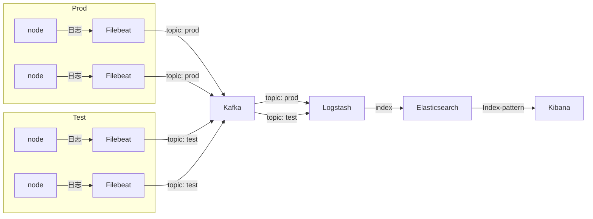

| 服务          | 建议节点数 | 依赖                 | 端口           |
| ------------- | ---------- | -------------------- | -------------- |
| zookeeper     | 3          | jdk                  | 2181/2888/3888 |
| kafka         | 3          | jdk                  | 9092           |
| elasticsearch | 3          | jdk                  | 9200/9300      |
| filebeat      |            | go语言开发，没有依赖 |                |
| logstash      |            | java                 | 9600           |
| kibana        |            | 无                   | 5601           |

