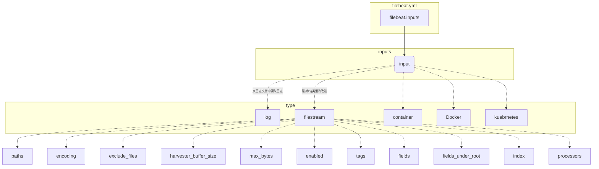

{}

os 版本： `CentOS Linux release 7.9.2009 (Core)`

filebeat版本：`7.17.29`

elasticsearch版本： `7.15.0`


Filebeat 由两个主要组件组成：[inputs](https://www.elastic.co/guide/en/beats/filebeat/7.17/how-filebeat-works.html#input) 和 [harvesters](https://www.elastic.co/guide/en/beats/filebeat/7.17/how-filebeat-works.html#harvester)。

+ inputs 负责管理采集器并查找所有要读取的源
+ harvesters负责读取逐行读取文件并将内容发送给出去,跟踪读取进度（记录在本地文件`data/registry/filebeat/log.json `）

{}


<table>
    <tr>
        <td></td>
        <td>
            <a href="https://www.elastic.co/guide/en/beats/filebeat/7.17/index.html">文档</a><br>
        </td>
        <td>
            <a href="https://mirrors.huaweicloud.com/filebeat/">下载</a><br>
        </td>
        <td>
            <a href="https://www.docker.elastic.co">docker镜像</a>
        </td>
    </tr>
</table>


### input配置


【学习目标】




**type 支持的类型：**


##### [Log](https://www.elastic.co/guide/en/beats/filebeat/7.17/filebeat-input-log.html)|[filestream](https://www.elastic.co/guide/en/beats/filebeat/7.17/filebeat-input-filestream.html)

> ~~**log** plugin deprecated in 7.16.0~~ ,use [filestream](https://www.elastic.co/guide/en/beats/filebeat/7.17/filebeat-input-filestream.html)

+ **paths** [必选参数，类型为数组]日志路径

  示例：

  ```yaml
  filebeat.inputs:
  - type: log
    enabled: true # 启用该input
    paths:
    - /var/log/messages
    - /var/log/*.log
    
  output.console:
    pretty: true
  ```

+ **encoding** [类型字符串]解码方式

  ```yaml
  filebeat.inputs:
  - type: log
    enabled: true # 启用该input
    paths:
    - /var/log/messages
    - /var/log/*.log
    encoding: utf8
    
  output.console:
    pretty: true
  ```

+ **exclude_lines**通过正则排除不需要采集的日志行

  ```yaml
  filebeat.inputs:
  - type: log
    enabled: true # 启用该input
    paths:
    - /var/log/messages
    - /var/log/*.log
    encoding: utf8
    exclude_lines: # 排除空行和以# 号开头的日志行
    - "^$"
    - "^#.*"
    
  output.console:
    pretty: true
  ```

+ **include_lines**采集符合正则规则的日志行

  ```yaml
  filebeat.inputs:
  - type: log
    enabled: true # 启用该input
    paths:
    - /var/log/messages
    - /var/log/*.log
    encoding: utf8
    exclude_lines: # 排除空行和以# 号开头的日志行
    - "^$"
    - "^#.*"
    include_lines: # 仅仅采集错误日志
    - ".*(ERR|err).*"
    
  output.console:
    pretty: true
  ```

+ **multiline** 多行匹配

  日志格式：

  ```log
  cat >>/var/log/1.log<<'EOF'
  [beat-logstash-some-name-832-2015.11.28] IndexNotFoundException[no such index]
      at org.elasticsearch.cluster.metadata.IndexNameExpressionResolver$WildcardExpressionResolver.resolve(IndexNameExpressionResolver.java:566)
      at org.elasticsearch.cluster.metadata.IndexNameExpressionResolver.concreteIndices(IndexNameExpressionResolver.java:133)
      at org.elasticsearch.cluster.metadata.IndexNameExpressionResolver.concreteIndices(IndexNameExpressionResolver.java:77)
      at org.elasticsearch.action.admin.indices.delete.TransportDeleteIndexAction.checkBlock(TransportDeleteIndexAction.java:75)
  EOF
  ```

  

  如果input类型为log，则书写格式为：

  
    {}

  ```yaml
  filebeat.inputs:
  - type: log
    enabled: true # 启用该input
    paths:
    - /var/log/1.log
    encoding: utf8
  
    multiline: # 示例中：把不是 [ 开头视为多行日志，并将不是[ 开头的行追加到前一行的后后面。
      type: pattern # 支持pattern 和 count
      pattern: '^\['
      negate: true # true表示否定模式，即不与pattern 匹配的内容被视为多行，默认为false。
      match: after
    
  output.console:
    pretty: true
  ```

  

    {}
    {}

  ```yaml
  filebeat.inputs:
  - type: log
    enabled: true # 启用该input
    paths:
    - /var/log/1.log
    encoding: utf8
  
    multiline.type: pattern
    multiline.pattern: '^\['
    multiline.negate: true
    multiline.match: after
    
  output.console:
    pretty: true
  ```

  

    {}
  

  

  如果input类型为filestream，则书写格式为：

  ```yaml
  filebeat.inputs:
  - type: filestream 
    enabled: true # 启用该input
    paths:
    - /var/log/1.log
    encoding: utf8
    parsers:
    - multiline: # 示例中：把不是 [ 开头视为多行日志，并将不是[ 开头的行追加到前一行的后后面。
        type: pattern # 支持pattern 和 count
        pattern: '^\['
        negate: true # true表示否定模式，即不与pattern 匹配的内容被视为多行，默认为false。
        match: after
    
  output.console:
    pretty: true
  ```

  

  

+ **将json格式的日志解析为json 键值对**

  

  
    {}

  ```yaml
  filebeat.inputs:
  - type: log
    enabled: true # 启用该input
    paths:
    - /var/log/1.log
    encoding: utf8
    json.keys_under_root: true
    
    multiline.type: pattern
    multiline.pattern: '^\['
    multiline.negate: true
    multiline.match: after
  
  output.console:
    pretty: true
  
  ```

  {} 

   {}

  ```yaml
  filebeat.inputs:
  - type: filestream 
    enabled: true # 启用该input
    paths:
    - /var/log/1.log
    encoding: utf8
    parsers:
    - multiline: # 示例中：把不是 [ 开头视为多行日志，并将不是[ 开头的行追加到前一行的后后面。
        type: pattern # 支持pattern 和 count
        pattern: '^\['
        negate: true # true表示否定模式，即不与pattern 匹配的内容被视为多行，默认为false。
        match: after
    - ndjson:
        keys_under_root: true
        message_key: message
    
  output.console:
    pretty: true
  ```

  

  

  {}
  


+ **harvester_buffer_size**单个harvester 可以使用的最大buffer。单位bytes

  ```yaml
  filebeat.inputs:
  - type: log
    enabled: true # 启用该input
    paths:
    - /var/log/messages
    - /var/log/*.log
    encoding: utf8
    exclude_lines: # 排除空行和以# 号开头的日志行
    - "^$"
    - "^#.*"
    include_lines: # 仅仅采集错误日志
    - ".*(ERR|err).*"
    harvester_buffer_size: 16384 # 默认值 16384 = 16k
    
  output.console:
    pretty: true
  ```

  

+ **max_bytes** 单条日志的最大bytes。 对于多行日志特别有用

  ```yaml
  filebeat.inputs:
  - type: log
    enabled: true # 启用该input
    paths:
    - /var/log/messages
    - /var/log/*.log
    encoding: utf8
    exclude_lines: # 排除空行和以# 号开头的日志行
    - "^$"
    - "^#.*"
    include_lines: # 仅仅采集错误日志
    - ".*(ERR|err).*"
    harvester_buffer_size: 16384 # 默认值 16384 = 16k
    max_bytes: 10485760 # 默认值 10485760 = 10MB
    
  output.console:
    pretty: true
  ```

  

  

+ **tags**[所有类型intput都支持]为日志文件添加tag 便于kibana 和 logstash 等进行筛选

  ```yaml
  tags:
  - "nginx"
  ```

+ **fields 和 fields_under_root[所有类型intput都支持]**  添加自定义字段

  ```yaml
  # 为document信息添加额外的信息
  fields:
    env: dev
  # 把fields 中添加的信息至于document信息的顶级
  fields_under_root: true
  ```


##### [journald](https://www.elastic.co/guide/en/beats/filebeat/7.17/filebeat-input-journald.html)

> 该功能处于实验阶段，[7.17下载](https://artifacts.elastic.co/downloads/beats/filebeat/filebeat-7.17.29-linux-x86_64.tar.gz) 之后版本中支持


收集服务日志

```yaml
filebeat.inputs:
- type: journald
  id: consul.service
  include_matches:
    - _SYSTEMD_UNIT=consul.service

- type: journald
  id: filebeat.service
  include_matches:
    - _SYSTEMD_UNIT=filebeat.service
```

收集内核日志

```yaml
filebeat.inputs:
- type: journald
  id: iptables
  include_matches:
    - _TRANSPORT=kernel
  processors:
    - drop_event:
        when.not.regexp.message: '^iptables'
```


##### tcp

