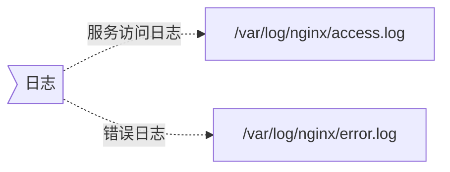

{}

os 版本： `CentOS Linux release 7.9.2009 (Core)`

filebeat版本：`7.17.29`

elasticsearch版本： `7.15.0`

{}





**配置nginx访问日志格式为json**

> 位置 http

```nginx
 log_format custom_json escape=json '{'
        '"level":"info",'
        '"ts": "$time_iso8601",'
        '"message": "handled request $request_method $request_uri",'
        '"request": {'
            '"id": "$http_x_request_id",'
            '"contry_code": "$geoip_country_code",'
            '"remote_ip": "$remote_addr",'
            '"remote_port": "$remote_port",'
            '"protocol": "$server_protocol",'
            '"method": "$request_method",'
            '"host": "$host",'
            '"uri": "$request_uri",'
            '"headers": {'
                '"user-agent": "$http_user_agent",'
                '"accept": "$http_accept",'
                '"accept-encoding": "$http_accept_encoding",'
                '"traceparent": "$http_traceparent",'
                '"tracestate": "$http_tracestate"'
            '}'
        '},'
        '"bytes_read": $request_length,'
        '"duration_msecs": $request_time,'
        '"size": $bytes_sent,'
        '"status": $status,'
        '"resp_headers": {'
          '"content_length": "$sent_http_content_length",'
          '"content_type": "$sent_http_content_type"'
        '}'
    '}'; 
```



  {}

  {}
```nginx
access_log  /var/log/nginx/access.log  custom_json;
```
  {}
  {}

> 语法 : `access_log /path/to/access.log custom_json if=<condition>;`
>
> `loggable` 为true  是记录日志，2xx， 3xx 不记录日志 

```nginx
http {
    map $status $loggable {
        ~^[23]  0;  # Match 2xx and 3xx status codes
        default 1;  # Log everything else
    }

    access_log /var/log/nginx/access.log combined if=loggable;
}
```

  {}
  {}

```nginx
access_log off;
```

或者

```nginx
access_log /dev/null;
```

  {}



**使用filbeat收集日志，关键参数 `json.keys_under_root: true`**

```yaml
cat >/data/elasticsearch/filebeat/filebeat.yml<<'EOF'
filebeat.inputs:
  - type: log
    id: accesslog
    paths:
      - /var/log/nginx/access*
    tags:
      - "nginx-access"
    # 将message中json格式日志解析出来，如果没有改配置日志文件将以字符串格式保存在message中
    # https://www.elastic.co/docs/reference/beats/filebeat/filebeat-input-log#filebeat-input-log-config-json
    json.keys_under_root: true

  - type: log
    id: errlog
    paths:
      - /var/log/nginx/error*
    include_lines:
    - "emerg"
    - "error"
    tags:
      - "nginx-error"
      

output.elasticsearch:
  hosts: ["192.168.0.114:9200"]
  indices:
    - index: "nginx-access-%{+yyyy.MM.dd}"
      when:
        contains:
          tags: "nginx-access"
    - index: "nginx-error-%{+yyyy.MM.dd}"
      when:
        contains:
          tags: "nginx-error"
  
# 禁用索引生命周期管理，默认为true。在启用 setup.ilm.enabled 状态下setup.template 配置不会生效
setup.ilm.enabled: false
# 加载索引模版，默认为true
setup.template.enabled: true
# 设置索引模板的名称，默认值为 filebeat-%{[agent.version]}
setup.template.name: "nginx"

# 设置索引模板的匹配模式,默认值为 filebeat-%{[agent.version]}-*
setup.template.pattern: "nginx-*"
# 覆盖已有的索引模板，默认值为false
setup.template.overwrite: true

# 配置索引模板属性
setup.template.settings:
  # 设置索引分片数量
  index.number_of_shards: 3
  # 设置索引副本数量，要求小于集群的数量
  index.number_of_replicas: 0
EOF
```


