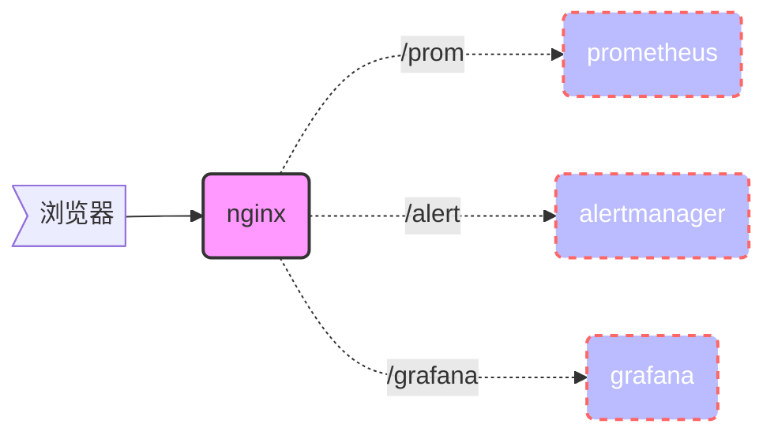

Prometheus是Go语言开发的开源监控和警报框架，遵循Apache 2.0许可协议。它起源于SoundCloud，并在2016年成为云原生计算基金会（CNCF）继Kubernetes之后的第二个项目。Prometheus不仅提供监控功能，还是一个时序[数据库](https://db-engines.com/en/ranking)。


本示例架构图

```nginx
        location /prom {
                proxy_pass http://127.0.0.1:9090;
        }

        location /alert {
                proxy_pass http://127.0.0.1:9093;
        }
        location /grafana {
                proxy_pass http://127.0.0.1:3000;
        }
```



