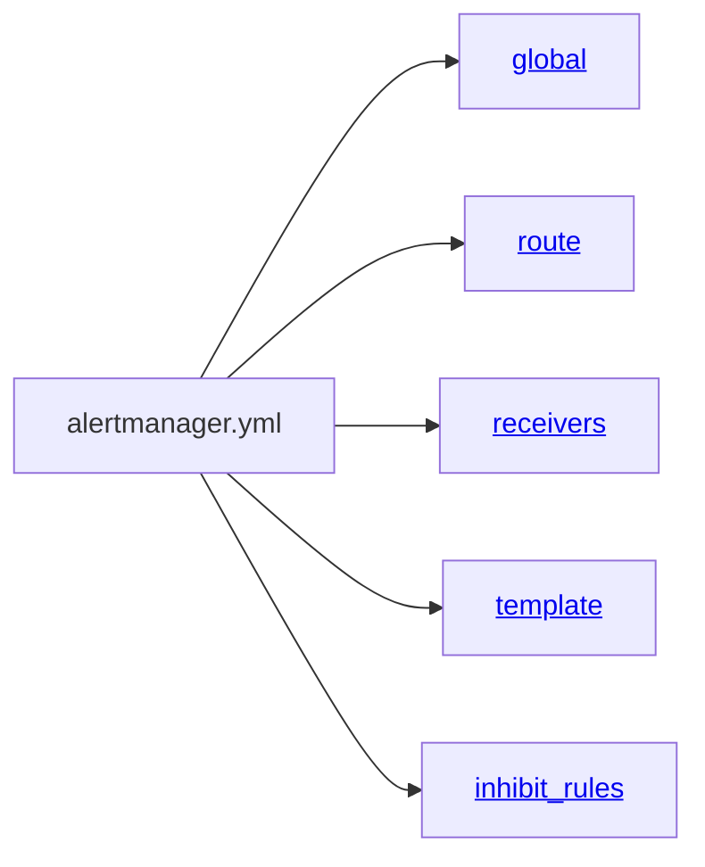

### 配置文件

alertmanager配置文件默认为 alertmanger.yaml主要包含5个顶级字段



<span id="global">**global**</span>

我们可以像这样什么都不定义

```yaml
global:
```


```yaml
global:
  # The smarthost 
  smtp_smarthost: 'smtp.qq.com:465'
  # from who send email
  smtp_from: '810654947@qq.com'
  smtp_auth_username: '810654947@qq.com'
  smtp_auth_password: 'kqaexaxpbrbdbajd'
  #
  smtp_require_tls: false
```

<span id="route">[**route**](https://prometheus.io/docs/alerting/latest/configuration/#route)</span>

```yaml
route
  receiver: default
  # 通过报警规则中的label 来聚合报警
  group_by: ['alertname','cluster']
  # When a new group of alerts is created, wait at
  # least 'group_wait' to send the initial notification.
  group_wait: 30s
  # 在同一个分组中。第一个报警发出后,等待`group_interval`才会发下一个警报
  group_interval: 5m
  # If an alert has successfully been sent, wait 'repeat_interval' to
  # resend them
  repeat_interval: 3h
  
  # match 和 match_re 在v1.0版本已经弃用
  match:
    [ <labelname>: <labelvalue>, ... ]
  # 使用正则匹配标签
  match_re:
  [ <labelname>: <regex>, ... ]

  # 子路由模块，拥有更高优先级
  routes:
  - receiver: 'database-pager'
    group_wait: 10s
    matchers:
    - service=~"mysql|cassandra"
  - receiver: 'frontend-pager'
    group_by: [product, environment]
    matchers:
    - team="frontend"
```


<span id="receivers">**receivers**</span>

```yaml
receivers:
  - name: 'default'
  email_configs:
  - to: 'xxxxx@.com'
  send_resolved: true
```


<span id="template">**template**</span>


<span id="inhibit_rules">[**inhibit_rules**](https://prometheus.io/docs/alerting/latest/configuration/#inhibit_rule)</span>

```yaml
# Inhibition rules allow to mute(静音) a alert according to another alert
global:
  ...
route:
  ...
inhibit_rules:
# 同一alertname的警报，如果存在 `critical` 级别的报警，则抑制 `warning` 级别的警报
- source_matchers:
  - severity="critical"
  target_matchers:
  - severity="warning"
  # alertname 相等
  equal: ['alertname']
```

```yaml
# DEPRECATED: Use target_matchers below.
# Matchers that have to be fulfilled in the alerts to be muted.
target_match:
  [ <labelname>: <labelvalue>, ... ]
# DEPRECATED: Use target_matchers below.
target_match_re:
  [ <labelname>: <regex>, ... ]

# A list of matchers that have to be fulfilled by the target 
# alerts to be muted.
target_matchers:
  [ - <matcher> ... ]

# DEPRECATED: Use source_matchers below.
# Matchers for which one or more alerts have to exist for the
# inhibition to take effect.
source_match:
  [ <labelname>: <labelvalue>, ... ]
# DEPRECATED: Use source_matchers below.
source_match_re:
  [ <labelname>: <regex>, ... ]

# A list of matchers for which one or more alerts have 
# to exist for the inhibition to take effect.
source_matchers:
  [ - <matcher> ... ]

# Labels that must have an equal value in the source and target
# alert for the inhibition to take effect.
[ equal: '[' <labelname>, ... ']' ]
```


```bash
[root@master prometheus]# curl http://10.4.7.10:9093/-/healthy 
OK
[root@master prometheus]# curl http://10.4.7.10:9093/-/ready
OK
[root@master prometheus]# curl -X POST http://10.4.7.10:9093/-/reload
```