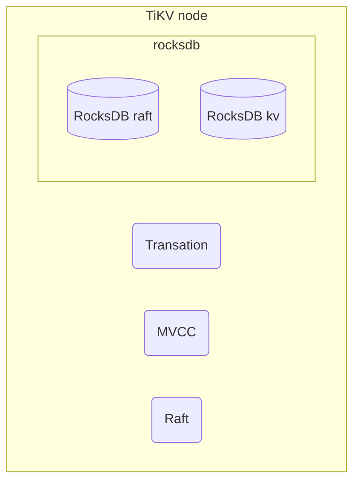

Tso(timestamp oracle) 用于标识事务的先后顺序

### tidb数据库架构


#### tidb server

tidb server为<font color=red>无状态</font>服务，在生产中可以启动多个实例并通过LB对外提供统一的连接地址。

**主要功能：**

1. 对外提供mysql 5.7协议的连接服务 （`protocol layer`）

2. 负责对sql解析、编译、优化并最终生成执行计划 (`parese`、`compile`)

   `parse` 通过此法分析器将sql 拆借成一个一个的字段，接着进行此法分析。将解析后的内容传递给 `compile`, 编译器执行逻辑优化和物理优化生成执行计划

3. 执行sql (`executor`、`distsql`、`kv`)、事务（`transaction`、`kv`）

4. 负责sql语句与tikv 数据结构的转化 。

   **表数据与 Key-Value 的映射关系:**

   TiDB 会为每个表分配一个表 ID，用 `TableID` 表示。表 ID 是一个整数，在整个集群内唯一。TiDB 会为表中每行数据分配一个行 ID，用 `RowID` 表示。行 ID 也是一个整数，在表内唯一。对于行 ID，TiDB 做了一个小优化，如果某个表有整数型的主键，TiDB 会使用主键的值当做这一行数据的行 ID。

   最终将每一行转换成以k:v 格式的数据,其中 `tablePrefix` 和 `recordPrefixSep` 都是特定的字符串常量，用于在 Key 空间内区分其他数据

   ```bash
   Key:   tablePrefix{TableID}_recordPrefixSep{RowID}
   Value: [col1, col2, col3, col4]
   ```

   

   

   **索引数据和 Key-Value 的映射关系:**

   与表数据映射方案类似，TiDB 为表中每个索引分配了一个索引 ID，用 `IndexID` 表示。

   对于主键和唯一索引，需要根据键值快速定位到对应的 RowID，因此，按照如下规则编码成 (Key, Value) 键值对：

   ```bash
   Key:   tablePrefix{tableID}_indexPrefixSep{indexID}_indexedColumnsValue
   Value: RowID
   ```

   对于不需要满足唯一性约束的普通二级索引，一个键值可能对应多行，需要根据键值范围查询对应的 RowID。因此，按照如下规则编码成 (Key, Value) 键值对：

   ```bash
   Key:   tablePrefix{TableID}_indexPrefixSep{IndexID}_indexedColumnsValue_{RowID}
   Value: null
   ```

   

4. 执行online DDL (`schema load`、`worker`、`start job`)在同一时刻只有一个tidbserver执行该操作

6. 垃圾回收（对于update 等多次的修改，数据库会保留历史版本，tidbserver 每隔10分钟(gc lifetime)执行一次历史版本的回收） （gc）

7. 缓存（memBuffer）默认使用tidb-server 所有内存。

   + sql结果
   + 线程缓存
   + 元数据，统计信息

   ```bash
   # 每个sql可以使用最大内存
   tidb_mem_quota_query
   # 超过最大缓存时的动作，可以是杀掉sql
   oom-action
   ```

   

6. 热点小表缓存功能（v6.0版本开始支持对热点表缓存）(`cache table`)

   + 64MB 以下的表
   
   + 查询频繁，修改极少
   
   + 缓存租约时间内，阻塞写操作。
   
   + 开启热点小表缓存的表，无法执行ddl 修改。
   
     
   
   

#### pd

被称为`placement driver` 是整个集群的大脑内置etcd,<font color=red>有状态</font>建议部署奇数实现高可用。

1. 存储每个 TiKV 节点实时的数据分布情况和集群的整体拓扑结构等元数据

1. 分配全局id和事务id

3. 负责为集群内各组件分配TSO 时间戳。这些时间戳用于为事务和数据分配时间标记。对于事务提供一个开始TSO 和一个结束TSO 。

   TSO 时间戳由两部分组成：

   + 物理时间戳：自 1970 年 1 月 1 日以来的 UNIX 时间戳，单位为毫秒
   + 逻辑时间戳：递增计数器，用于需要在一毫秒内使用多个时间戳的情况，或某些事件可能触发时钟进程逆转的情况。在这些情况下，物理时间戳会保持不变，而逻辑时间戳保持递增。该机制可以确保 TSO 时间戳的完整性，确保时间戳始终递增而不会倒退。

   

4. 根据 TiKV 节点上报的数据动态均衡数据分布,例如：

   + 对tikv执行leader、热点region 均衡

   - 集群拓扑
   - 缩容
   - 故障恢复
   - Region merge

5. 根据label，支持对region分布的手动调度。

   tikv实例添加zone 、rack、host等标签后，可以通过pd的调度功能实现基于标签不同级别的高可用。（k8s的node节点添加标签后当pod调度时添加亲和反亲和策略）

3. 提供 TiDB Dashboard 管控界面

   


#### TiKV

作为分布式存储系统,tikv基于key-value方式存储数据。数据按照key的范围保存到region中，region是tikv的最小存储单元（大小在96MB-144MB之间），每个region默认保证三个副本通过raft协议保证数据的强一致性，而数据的落盘则调用 Facebook 开源的rocksDB实现。<font color=red>有状态服务</font>

##### RocksDB

`RocksDB` 是 Facebook 开源的单机 KV 存储引擎，内部使用LSM存储引擎


**数据存储流程：** 数据存储时先写入wal 预写日志和 memTable中，当memtable 写入达到指定大小后将该memtable 归档并入immutable 的队列中，从新开启一个新的memtable继续接收新的写入。开启一个新线程将队列中的数据持续写入磁盘持久化

当队列中等待写入磁盘的队列大于5时，rocksdb开启流量控制降低写入速度。

磁盘中文件按照压缩级别分为6个级别：

level0 是 immutable的数据复刻，level0数据达到一定大小时rocksdb 执行数据合并压缩（compaction）生成level1文件，依次类推。 每一个文件称为SST（stored string table）


**数据读取流程：** rocksdb中存在一个*blockcache* 的查询内存空间用于缓存最近查询，如果缓存中不存在则从memtable中查找，如果memtable找不到，继续去磁盘中通过*二分查找法*继续查找

**数据删除流程：** 无需要查找到原始数据，只需要执行del操作


**RocksDB列族（column family）:** 是rocksdb的数据分片技术，可以按照不同的id分配给不同的**列族**，如果未指定列族则写入default。一个rocksdb 实例可以对应多个列族，每个列族有自己的memtabl 、SST ，共享wal


##### Raft

RocksDB提供单机存储能力，为保证数据的高可用引入了[raft协议](https://raft.github.io/raft.pdf)。TiKV 利用 Raft 来做数据复制，每个数据变更都会落地为一条 Raft 日志，通过 Raft 的日志复制功能，将数据安全可靠地同步到复制组的每一个节点中。通过实现 Raft，TiKV 变成了一个分布式的 Key-Value 存储。

+ Leader选举。

  在raft协议中节点刚创建时所有节点都处于*flollower*状态，在指定的 *election timeout*  时间内如果没有找到 *leader* ,优先达到 *election timeout* 的节点将发起选举进入*candidate* 状态并将`term+1`，在获得多数投票后该成员状态转为 *leader* 状态。

  

  集群关系建立后，*leader*定期向*follower* 发送心跳消息，在指定的 *heartbeat time interval* 内未收到 *leader* 的心跳信息的*follwer* 将会进入下一个*term* 并发起选举进去*candidate*状态，在获得多数投票后该成员状态转为 *leader* 状态。

  

+ 日志复制

  raft 主从节点之间通过日志复制实现数据的一致性，期间经历以下阶段：

  1. `propose` leader将写入请求转成raft log 格式
  2. `append` 保存日志到 *leader* 本地
  3. `replicate` 收到集群内大多数节点日志复制成功的确认消息
  4. `commited` 收到集群内大多数节点日志复制成功并持久化到本地确认消息
  5. `apply` 成功完成日志的持久化写入

  

+ 成员变更（如添加副本、删除副本、转移 Leader 等操作）


##### MVCC

`MVCC (Multi-Version Concurrency Control)`假设有这样一种场景：某客户端 A 在写一个 Key，另一个客户端 B 同时在对这个 Key 进行读操作。如果没有数据的多版本控制机制，那么这里的读写操作必然互斥。在分布式场景下，这种情况可能会导致性能问题和死锁问题。有了 MVCC，只要客户端 B 执行的读操作的逻辑时间早于客户端 A，那么客户端 B 就可以在客户端 A 写入的同时正确地读原有的值。即使该 Key 被多个写操作修改过多次，客户端 B 也可以按照其逻辑时间读到旧的值。

##### Transaction

1. `Transaction`提供了分布式事务能力

    两阶段提交 
    
    第一阶段：`prewrite`  设置锁信息，并将锁在rocksdb的lock列族中（锁信息仅在事务的第一行所在的tikv实例的lock列族中添加锁，其他行所在tikv lock列族引用该锁的地址）。需要修改的信息放入到default 列族中（修改信息大于255byte 放入default 列族中，小于255bytes放入到write列族中）
    
    
    
    第二阶段：`commit` 从pd中获取tso,在write列族中写入提交信息。并释放lock 列族中的锁信息

##### coprocessor

1. coprocessor算子下推(在每个tikv中执行例如 `where` 、`group by` 等操作，过滤后再发给tidb server)


**tikv 数据读取流程**

用户从tidb-server 发起查询请求，此时从pd 分配一个tso给到该线程，并告知该线程用户需要读取的数据在哪个tikv节点





### tidb HTAP


TiDB 是PingCAP 公司开源的分布式数据库，兼容mysql协议支持水平扩缩容能力，同时实现HTAP（OLTP online transactional processing 和 OLAP online analytical processing）。具备智能选择（CBO自动或人工选择）能力

**OLTP 特征：**

+ 支持试试更新的行存
+ 高并发、一致性要求高
+ 每次操作少量数据

**OLAP 特征：**

+ 批量更新列存
+ 并发数低
+ 每次操作大量数据


+ **tiflash：** 是TiDB HTAP(OLAP OLTP ) 形态的关键组件，它是 TiKV 的列存扩展。和普通 TiKV 节点不一样的是，在 TiFlash 内部作为`learner`角色加入到tikv 的`region` 通过`raft log` 异步复制leader数据,tiflash不参与tikv数据选举、投票，数据是以列式的形式进行存储，主要的功能是为分析型的场景加速。可以理解为<font color=red>tikv是行存储，tiflash 是列存储。</font>

  

  

  
  
  MPP架构：每个tiflash 作为worker节点首先过滤符合条件的数据，之后按照 **等值连接** 将具有符合条件的数据执行数据交换到同一台tiflash中执行聚合计算
  
  
  
  ```sql
  tidb_allow_mpp      
  tidb_enforce_mpp
  ```
  
  
  
  
  
  


### 6.0新功能

+ 热点小表缓存（表的特征：1. 表的数据不大(小于64MB) 2. 只读表或者修改不频繁的表 3.表的访问特别频繁）用于将表缓存在tidb server 的`cache table` 中提升读性能。

  开启热点小表缓存的表，无法做ddl 的修改

  实现原理：通过租约的方式缓存表内容，在租约时间范围内该表只能读，写处于阻塞状态。租约到期后批量将写内容更新的tikv，并更新tidb server的`cache table`重新计算租约时间。 相关参数 `tidb_table_cache_lease=5`

  具体实现：

  ```sql
  alter table t1 cache;
  ```

  

+ `placement rules in sql ` 使用sql的方式精细化调度表在tikv的分布、副本数

  创建一个规则

  ```sql
  CREATE PLACEMENT POLICY P1
  PRIMARY_REGION = "Beijing"   --leader 角色的region位置
  REGIONS = "Beijing, Tokyo, Shanghai, London"  --follower角色的region位置
  FOLLOWERS = 4; --follower数量
  ```

  创建表时引用该规则

  ```sql
  CREATE TABLE T5 (id INT) PLACEMENT POLICY=P1;
  ```

  

+ 内存悲观锁, 事务的锁信息放置在leader 所在tikv的缓存中不会将锁信息复制到follwer节点，减少了磁盘io。当leader所在节点的tivk宕机后锁信息会丢失此时事务执行回滚。

  ```sql
  --在线开启内存悲观锁
  set config tikv pessimistic-txn.pipelined='true';
  set config tikv pessimistic-txn.in-memory='true';
  ```

+ topsql 基于cpu的使用量查找对应的sql。

  例如：单个tikv 实例负载较高，此时可以使用topsql 功能查找到对应sql

+ tidb enterprise manager (TiEM) 可视化管理工具

  1. 部署集群
  2. 升级集群
  3. 参数管理
  4. 组件管理
  5. 备份恢复与高可用管理
  6. 集群监控与告警
  7. 集群日志收集
  8. 审计与安全

### tidb cloud

是一个DBaas 服务


**1. 关于 TiKV 或 TiDB Server，下列说法不正确的是?**

  - [ ] A. 数据被持久化在 TiKV 的 RocksDB 引擎中
  - [ ] B. 对于老版本数据的回收（GC），是由 TiDB Server 在 TiKV 上完成的
  - [x] C. 两阶段提交的锁信息被持久化到 TiDB Server 中
  - [ ] D. Region 可以在多个 TiKV 节点上进行调度，但是需要 PD 节点发出调度指令

解题：tidb server 不存储数据


**2.关于关系型数据与KV的转化，下列说法不正确的是？**

  - [ ] A. 如果没有定义主键，key中包含RowID，IndexID和TableID，都是int64类型
  - [ ] B. Table ID在整个集群内唯一
  - [x] C. 如果定义了主键，那么将使用主键作为RowID
  - [ ] D. 不需要为每张表指定主键


**3.关于关系型数据与 KV 的转化，下列说法**不正确**的是？**

- [ ] A. 如果没有定义主键，key 中包含 RowID、IndexID 和 TableID，都是 int64 类型
- [ ] B. Table ID 在整个集群内唯一
- [x]  C. 如果定义了主键，那么将使用主键作为 RowID
- [ ]  D. 不需要为每张表指定主键

**解释：** C 如果定义了主键，并主键为整数型的，TiDB 会使用主键的值当做这一行数据的RowID。


+ 6.0版本region 默认96MB,当达到144MB 是自动分裂

+ 所有tidb server都可以接受ddl任务，并将ddl任务放在tikv 队列中。同一时刻只有一个tidb server的worker 模块是ower角色，该worker拥有执行ddl 任务的权利
+ tidb server 的gc 间隔默认10m一次


[课程中心](https://learn.pingcap.cn/learner/course)

[TiDB 整体架构 | TiDB 文档中心](https://docs.pingcap.com/zh/tidb/stable/tidb-architecture/)

[TiKV 简介 | TiDB 文档中心](https://docs.pingcap.com/zh/tidb/stable/tikv-overview/)


```sql
mysql> set global  tidb_enable_top_sql=ON;

mysql> show variables like '%top%';
+------------------------------------+------------+
| Variable_name                      | Value      |
+------------------------------------+------------+
| ft_stopword_file                   | (built-in) |
| innodb_ft_enable_stopword          | ON         |
| innodb_ft_server_stopword_table    |            |
| innodb_ft_user_stopword_table      |            |
| rpl_stop_slave_timeout             | 31536000   |
| tidb_enable_top_sql                | ON         |
| tidb_top_sql_max_meta_count        | 5000       |
| tidb_top_sql_max_time_series_count | 100        |
+------------------------------------+------------+
8 rows in set (0.01 sec)
```


### sql 中的锁和事务

SQL-92 标准定义了 4 种隔离级别：读未提交 ()、读已提交 ()、可重复读 ()、串行化 ()。 详见下表：`READ UNCOMMITTED`、`READ COMMITTED`、`REPEATABLE READ`、`SERIALIZABLE`

| 隔离级别         | 脏写   | 脏读   | 模糊读取 | 幻读   |
| :--------------- | :----- | :----- | :------- | :----- |
| READ UNCOMMITTED | 不可能 | 可能   | 可能     | 可能   |
| READ COMMITTED   | 不可能 | 不可能 | 可能     | 可能   |
| REPEATABLE READ  | 不可能 | 不可能 | 不可能   | 可能   |
| SERIALIZABLE     | 不可能 | 不可能 | 不可能   | 不可能 |

TiDB 语法上支持设置 和 两种隔离级别：`READ COMMITTED``REPEATABLE READ`


缓存表的功能

rocksdb 性能与cpu数量的关系

导入数据后的一致性校验可以借助Coprocessor 由TiKV来完成

tidb server 各个组件的功能

GC life time是无法手工调整的

SQL语句的解析和编译可以与TSO的获取异步执行

sql 解析和编译流程，物理编译和逻辑编译

tidb cloud 的功能


