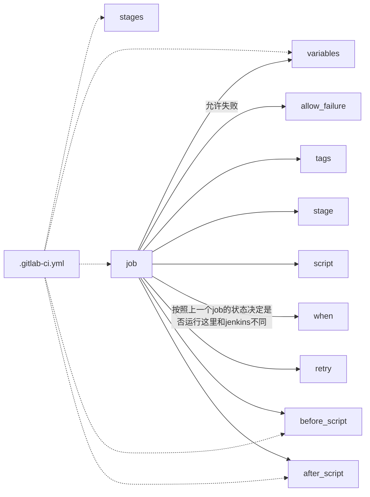

### ci/cd工具

#### 注册runner

runner 是go语言编写，真正执行ci构建的组件，runner不绑定任何端口

【runner分类】

+ instance类型，所有项目可用
+ group 类型，组成员可用
+ project类型，该项目可用

##### 注册nstance类型 runner


**安装runner**

```bash
curl -L --output /usr/local/bin/gitlab-runner https://s3.dualstack.us-east-1.amazonaws.com/gitlab-runner-downloads/v15.5.0/binaries/gitlab-runner-linux-386

chmod +x /usr/local/bin/gitlab-runner

useradd --comment 'GitLab Runner' --create-home gitlab-runner --shell /bin/bash

gitlab-runner install --user=gitlab-runner --working-directory=/home/gitlab-runner
gitlab-runner start
```

```bash
[root@tidb-dev01-s2 tmp]# gitlab-runner -v
Version:      15.5.0
Git revision: 0d4137b8
Git branch:   15-5-stable
GO version:   go1.18.7
Built:        2022-10-22T23:52:17+0000
OS/Arch:      linux/386
```


**注册runner 到gitlab**

```bash
gitlab-runner register --url http://192.168.0.247/ --registration-token ADtKhX4s9UfJ6Fnn8vs_
```


非交互式注册

```bash
gitlab-runner register \
--non-interactive \
--url http://192.168.0.247/ \
--registration-token "GR1348941aQM2R2A6-Jgm_xtbnjGN" \
--executor "shell" \
--description "用于构建golang项目" \
--tag-list "linux,go" \
--run-untagged=true \
--locked false \
--access-level not_protected
```


```bash
gitlab-runner register \
--non-interactive \
--url http://192.168.0.247/ \
--registration-token "GR1348941q6P-P5K4vkyCjNWnMBsm" \
--executor "shell" \
--description "用于构建golang、java项目" \
--tag-list "linux,go,mvn" \
--run-untagged=true \
--locked false \
--access-level not_protected
```


##### 注册group类型 runner


安装和注册方式与instance 类型一致，只是其中注册命令中的token 不同

##### 注册project类型 runner


安装和注册方式与instance 类型一致，只是其中注册命令中的token 不同


#### 流水线文件


名词：
流水线： 一个.gitlab-ci.yml 是一个流水线
作业： 一个job 是一个作业




pipeline 变量

本次提交跳过流水线


语法：
```yaml
stages:
- build
- test
- deploy
job1:
  tags:
  - linux
  stage: build
  script:
  - echo "123"
job2:
  tags:
  - linux
  stage: .post
  allow_failure: true
  script:
  - echo "456"
```

环境变量
```yaml
stages:
- build
variables:
  k1: "v1"
  k2: "v2"
job1:
  variables:
    k1: "v1"
    k2:
      value: "v2"
      description: "k2 这个变量对应的值是v2,我只是一个描述信息"
  tags:
  - linux
  stage: build
  script:
  - echo "${k1}"


```

job 作业

