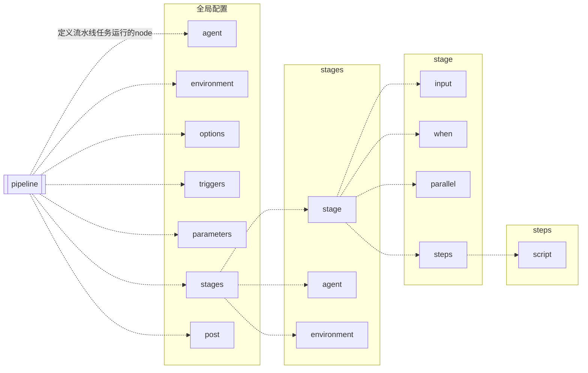

### 服务部署


> 端口 8080  5000

---

**数据目录**

```bash
mkdir /jenkins

pvcreate /dev/sdb
vgextend centos /dev/sdb
lvcreate --name jenkins --size 99G  centos
mkfs.ext4 /dev/mapper/centos-jenkins
echo '/dev/mapper/centos-jenkins /jenkins        ext4     defaults,noatime        0 0' >>/etc/fstab
mount -a
```

**安装jenkins**

  {}
  {}

  ```bash
  wget --no-check-certificate -O /etc/yum.repos.d/jenkins.repo https://pkg.jenkins.io/redhat-stable/jenkins.repo
  ```

  ```bash
  rpm --import https://pkg.jenkins.io/redhat-stable/jenkins.io-2023.key
  # /usr/share/java/jenkins.war 升级时替换该文件
  yum install -y java-11-openjdk.x86_64  jenkins
  ```

  ```bash
  echo 'JENKINS_HOME=/jenkins' >/etc/jenkins.env
  
  [Service]
  EnvironmentFile=/etc/jenkins.env
  
  USER=root
  
  systemctl daemon-reload 
  systemctl restart jenkins
  systemctl enable jenkins --now
  ```
  
  {}
  {}
  ```bash
  docker run --name jenkins \
  --restart=always \
  --ip=192.168.31.241 \
  --network macvlan31 \
  -v /jenkins:/var/jenkins_home \
  -v /usr/local/jdk:/usr/local/jdk \
  -v /usr/local/maven:/usr/local/maven \
  -e JENKINS_Uc=https://mirrors.cloud.tencent.com/ienkins/ \
  -e JENKINS_UC DOWNLOAD=https://mirrors.cloud.tencent.com/jenkins \
  -d jenkins/jenkins:lts
  ```
  {}
  {}
  ```bash
  JENKINS_HOME=/jenkins
  prerun() {
      yum install fontconfig freetype -y
  }
  download(){
      wget https://download.java.net/java/ga/jdk11/openjdk-11_linux-x64_bin.tar.gz
      wget https://mirrors.tuna.tsinghua.edu.cn/jenkins/war-stable/2.452.1/jenkins.war
      wget https://mirrors.tuna.tsinghua.edu.cn/apache/tomcat/tomcat-8/v8.5.100/bin/apache-tomcat-8.5.100.tar.gz
  }
  
  jdk(){
      tar xf openjdk-11_linux-x64_bin.tar.gz -C /opt
      ln -svf  /opt/{jdk-11,jdk}
  
  cat>>/etc/profile<<EOF
  export JAVA_HOME=/opt/jdk
  export JAVA_JRE=\$JAVA_HOME/jre
  export CLASSPATH=\$JAVA_HOME/lib:\$JAVA_HOME/jre/lib
  export PATH=\$JAVA_HOME/bin:\$JAVA_JRE/bin:$PATH:.
  EOF
  
      source /etc/profile
      java -version
  }
  
  start(){
      echo "export JENKINS_HOME=${JENKINS_HOME}" /etc/profile
      source /etc/profile
      tar xf apache-tomcat-8.5.100.tar.gz -C /opt
      ln -svf /opt/apache-tomcat-8.5.100/ /opt/tomcat
      cp  jenkins.war /opt/tomcat/webapps/
      # 前台启动tomcat /opt/tomcat/bin/catalina.sh run 
      /opt/tomcat/bin/catalina.sh start 
  }
  
  
  main(){
      prerun
      download
      jdk
      start
  }
  main
  ```
  {}

  

#### 安装插件

{}
修改jenkins插件仓库地址
> ui操作路径： Dashboard>Manager Jenkins>Plugins>Advanced setting
```bash
https://updates.jenkins.io/update-center.json
https://mirrors.tuna.tsinghua.edu.cn/jenkins/updates/update-center.json
```
{}

> 插件安装命令： `jenkins-plugin-cli --plugins uno-choice:2.8.3`

```bash
跳过证书认证【 skip-certificate-check 】
中文插件 chinese 【 Localization: Chinese (Simplified) 】
基于RBAC的权限管理 【 Role-based Authorization Strategy 】
参数化构建支持复选框【 uno-choice 】
pipeline流水线插件【 Pipeline 】
pipline可视化插件 【 Pipeline: Stage View】
Blue Ocean插件 【 Blue Ocean 】
聚合git命令【 Git 】
支持参数化构建和jsonpath解析的webhook触发器 【 Generic Webhook Trigger 】
邮件扩展插件 【 Email Extension 】
集成sonarqube扫描插件【 SonarQube Scanner 】
-------------------------
在consol的输出中添加时间戳 【 Build Timestamp 】
清理流水线中产生的历史文件 【 Workspace Cleanup 】
备份全局配置和job配置【 ThinBackup 】 
支持从git中选择分支、版本、tag 的功能【 git parameter 】
Blue Ocean插件 【 BlueOcean Aggregator】
流水线Pipeline插件 【 workflow-aggregator 】
ssh连接到部署主机插件 【 Publish Over SSH 】
把docker作为agent使用【 Docker Slaves 】
构建maven项目【 Maven Integration 】
在gitlab 使用触发器构建时可以匿名触发构建【 Build Authorization Token Root 】
集成ldap认证登录 【 ldap 】
```
---
#### 通用环境

+ git
+ ssh-key认证
+ docker
+ ansible
+ kubectl

#### 项目编译环境

  {}
  {}

+ jdk 环境

  ```bash
  wget https://download.java.net/java/ga/jdk11/openjdk-11_linux-x64_bin.tar.gz
  tar xf openjdk-11_linux-x64_bin.tar.gz -C /opt
  ln -svf  /opt/{jdk-11,jdk}
  
  cat>>/etc/profile<<EOF
  export JAVA_HOME=/opt/jdk
  export JAVA_JRE=\$JAVA_HOME/jre
  export CLASSPATH=\$JAVA_HOME/lib:\$JAVA_HOME/jre/lib
  export PATH=\$JAVA_HOME/bin:\$JAVA_JRE/bin:$PATH:.
  EOF
  
  source /etc/profile
  java -version
  ```

+ maven 环境

  ```bash
  wget https://mirrors.aliyun.com/apache/maven/maven-3/3.8.8/binaries/apache-maven-3.8.8-bin.tar.gz
  tar xf apache-maven-3.8.8-bin.tar.gz -C /opt
  ln -svf /opt/apache-maven-*  /opt/maven
  export PATH=${PATH}:/opt/maven/bin
  ```

  ```bash
  # 设置国内镜像地址
  sed -i /\<mirrors\>/\a"<mirror>\n  <id>aliyunmaven</id>\n  <mirrorOf>*</mirrorOf>\n  <name>阿里云公共仓库</name>\n  <url>https://maven.aliyun.com/repository/public</url>\n</mirror>" /opt/maven/conf/settings.xml
  ```

  ```bash
  mvn clean package -DskipTests=true
  mvn clean package
  mvn test
  ```
  {}
  {}
+ jdk 环境

  ```bash
  wget https://download.java.net/java/ga/jdk11/openjdk-11_linux-x64_bin.tar.gz
  #https://download.java.net/openjdk/jdk17.0.0.1/ri/openjdk-17.0.0.1+2_linux-x64_bin.tar.gz
  tar xf openjdk-11_linux-x64_bin.tar.gz -C /opt
  ln -svf  /opt/{jdk-11,jdk}
  
  cat>>/etc/profile<<EOF
  export JAVA_HOME=/opt/jdk
  export JAVA_JRE=\$JAVA_HOME/jre
  export CLASSPATH=\$JAVA_HOME/lib:\$JAVA_HOME/jre/lib
  export PATH=\$JAVA_HOME/bin:\$JAVA_JRE/bin:$PATH:.
  EOF
  
  source /etc/profile
  java -version
  ```

  

+ gradle 环境
  ```bash
  # 打包并跳过测试
  gradle build -x test
  ```
  {}

  {}
  + golang 1.20.6
    ```bash
    # wget https://golang.google.cn/dl/go1.23.1.linux-amd64.tar.gz
    wget https://golang.google.cn/dl/go1.20.6.linux-amd64.tar.gz
    tar xf go1.20.6.linux-amd64.tar.gz -C /opt/
    cat >>/etc/profile <<EOF
    export GOROOT=/opt/go
    export GOPATH=/opt/gopath
    export PATH=\$GOPATH/bin:\$GOROOT/bin:$PATH
    export GO111MODULE="on"
    export GOPROXY="https://goproxy.cn,direct"
    EOF
    ```
    
    ```bash
    source /etc/profile
    go version
    go env
    ```
    
  {}
  {}
+ v16.x

  ```bash
  wget https://nodejs.org/dist/v14.21.3/node-v14.21.3-linux-x64.tar.gz
  tar xf node-v14.21.3-linux-x64.tar.gz -C /opt
  ln -svf /opt/node-v14.21.3-linux-x64/ /opt/node

  echo "export PATH=/opt/node/bin:$PATH" >>/etc/profile
  source /etc/profile
  npm config set registry https://registry.npmmirror.com
  ```


  ```bash
  # https://nodejs.org/zh-cn/download/prebuilt-binaries
  wget https://nodejs.org/dist/v16.20.2/node-v16.20.2-linux-x64.tar.xz
  tar xf node-v16.20.2-linux-x64.tar.xz -C /opt
  ln -svf /opt/node-v16.20.2-linux-x64/ /opt/node
  ```

  ```bash
  echo "export PATH=/opt/node/bin:$PATH" >>/etc/profile
  source /etc/profile
  npm config set registry https://registry.npmmirror.com
  ```
  验证
  ```bash
  node -v
  # v16.20.2
  npm -v
  # 8.19.4
  ```
  构建命令
  ```bash
  npm install --force && npm run build
  ```
  创建一个vue项目
  ```bash
  # 安装vue-cli 工具
  npm install vue-cli -g 
  ls /opt/node/bin/
  # 初始化项目
  vue-init webpack demo
  cd demo/
  # 运行项目
  npm  run dev
  ```
  
  {}
  {}
+ v16.x

  ```bash
  # https://nodejs.org/zh-cn/download/prebuilt-binaries
  wget https://nodejs.org/dist/v16.20.2/node-v16.20.2-linux-x64.tar.xz
  tar xf node-v16.20.2-linux-x64.tar.xz -C /opt
  ln -svf /opt/node-v16.20.2-linux-x64/ /opt/node
  ```

  ```bash
  echo "export PATH=/opt/node/bin:$PATH" >>/etc/profile
  source /etc/profile
  npm config set registry https://registry.npmmirror.com
  ```

  ```bash
  node -v
  # v16.20.2
  npm -v
  # 8.19.4
  npm install yarn -g 
  [root@lavm-ioreaqndwv demo]# ls /opt/node/bin/
  corepack  node  npm  npx  vue  vue-init  vue-list  yarn  yarnpkg
  [root@lavm-ioreaqndwv demo]# yarn config set registry https://registry.npmmirror.com
  yarn config v1.22.22
  success Set "registry" to "https://registry.npmmirror.com".
  Done in 0.05s.
  ```
  ```bash
  # 编译命令
  yarn install
  yarn build
  ```
  {}
  {}
  待补充
  {}
  {}
  待补充
  {}


---

#### 安装node节点

jenkins 支持分布式构建，按照角色可以分为master 和 node 节点。master 负责调度和控制，node节点负责执行调度来的流水线任务。按照一下步骤配置node节点：

master 开启端口监听
> 配置方式： Dashboard > Manage Jenkins > Security 

1. 在jenkins master 端开启用于agent连接的端口,默认是5000
   

2. 新增一个node 节点
   
   > 配置方式： Dashboard > Manage Jenkins > Nodes
   > 新增node节点配置
   
   
   
   
   1. node节点与master时钟同步
   2. node 节点安装java环境
   3. 启动服务
      ```bash
      curl -sO http://175.178.65.213:8080/jnlpJars/agent.jar
      java -jar agent.jar -url http://175.178.65.213:8080/ -secret 689e3241630eb34c444894f78caed7eec4c6d83f2b555bd917e8be369f70a59e -name "seagull-build01" -workDir "/jenkins"
      ```
      ```bash
      tee /usr/lib/systemd/system/jenkins-agent.service <<EOF
      [Unit]
      Description=jenkins-agent service https://jenkins.io/
      After=network.target
      
      [Service]
      ExecStart=/opt/jdk/bin/java -jar /opt/agent.jar -url http://175.178.65.213:8080/ -secret 689e3241630eb34c444894f78caed7eec4c6d83f2b555bd917e8be369f70a59e -name "seagull-build01" -workDir "/jenkins"
      
      User=root
      [Install]
      WantedBy=multi-user.target
      EOF
      ```
      ```bash
      systemctl daemon-reload
      systemctl enable jenkins --now
      systemctl status jenkins
      ```
   
   4. 调度任务测试
      ```groovy
      pipeline {
        agent {
          label 'seagull'
        }
        stages {
          stage('test'){
            steps {
              echo 'test'
            }
          }
        }
      }
      ```
   
   


### 流水线

#### 自由风格流水线

选择freestyle 模式构建，下面是一个简单ci实例：


```bash
# 构建命令
sh -c "git clone https://gitee.com/mingtian66/magic-api.git && cd magic-api && git checkout master && cd magic-api && JAVA_HOME=/opt/jdk-17.0.11;PATH=$JAVA_HOME/bin:$PATH; mvn clean package "
```

构建后清理workspace,依赖插件【Workspace Cleanup】


#### 触发构建

+ **Trigger builds remotely (e.g., from scripts) 【webhook构建】**

  
  配置后打开浏览器在地址栏输入一下内容并回车，会发现magic_api项目被触发了一次构建。

  ```bash
  http://10.4.7.250:8080/jenkins/job/magic_api/build?token=54fb6627dbaa37721048e4549db3224d
  ```
  携带用户名和密码
  ```bash
  curl -uadmin:admin http://10.4.7.250:8080/jenkins/job/magic_api/build?token=54fb6627dbaa37721048e4549db3224d
  ```
  参数化构建
  ```bash
  curl -uadmin:admin "http://10.4.7.250:8080/jenkins/job/magic_api/buildWithParameters?token=54fb6627dbaa37721048e4549db3224d&VERSION=4.4.4"
  ```

  上面这种方式未登录用户无法触发，如果要绕过这个问题需要安装插件【Build Authorization Token Root】实现匿名构建
  调用方式

  ```bash
  http://10.4.7.250:8080/jenkins/buildByToken/build?job=magic_api&token=54fb6627dbaa37721048e4549db3224d
  ```

+ **Build after other projects are built 【其他job触发构建】**

+ **Build periodically 【周期构建】**

  H 表示hash 取随机数字，防止多个job同时构建

  ```bash
  * * * * *  每分钟构建一次
  H * * * *  使用 H 代替随机数作为起始时间，每分钟构建一次。这个随机数是有job名称hash后得到的，用于避免多个job同时构建
  H/15 * * * *  使用 H 代替随机数作为起始时间，每间隔15分钟构建一次
  H(0-10) * * * *  在0-10分钟内取一个随机值作为起始时间，每间隔15分钟构建一次
  ```

  

+ **Poll SCM 【jenkins主动周期性发起检查代码变动，则构建】**


#### pipline 流水线
{}
<sub>需要安装 【 Pipeline 】 插件</sub>

优势：灵活性高，代码即服务

语法：1. 声明式语法 2.脚本式语法 。两者可以结合使用,通过在steps{ } 中嵌入 scripts{} 书写groovy脚本。
{}


#### pipline 声明式语法
> Jenkins Pipeline 的定义被写入一个文本文件（称为Jenkinsfile）


在jenkins中提供了声明式语法生成器，以下是打开这个生成器的方法：


+ **agent** 指定了流水线在那个节点运行

  > 位置：全局、stages

  ```groovy
  // 在任意节点运行
  agent any
  ```

  ```groovy
  // 在存在标签为 'nodejs'的节点运行
  agent {
    label 'nodejs'
  }
  // 
  agent {
    label 'my-label1 && my-label2' 
    }
  // 
  agent {
     label 'my-label1 || my-label2' 
     }
  ```

  ```groovy
  // 没有节点运行
  agent none
  ```

  + **动态agent**

    ```bash
    待补充
    ```

    

    

+ **environment** 指定变量

  > 位置：全局、stages
  
  environment用于定义环境变量，在jenkins中已经包含了一些内置变量，例如：`${JOB_NAME}、${BUILD_NUMBER} `
  
  ```bash
  pipeline {
      agent any
      stages {
          stage("test") {
              steps {
                  script {
                      println "构建ID在 jenkins1.597+ 版本后与BUILD_NUMBER 功能一样 ： ${BUILD_ID}"
                      println "构建NUMBER ： ${BUILD_NUMBER}"
                      // 拼接了jenkins-${JOB_NAME}-${BUILD_NUMBER} 
                      println "jenkins-JOB_NAME-BUILD_NUMBER: ${BUILD_TAG}"
                      println BUILD_URL
                      // println JAVA_HOME
                      println JENKINS_URL
                      println JOB_NAME 
                      println NODE_NAME
                  }
              }
          }
      }
  }
  ```
  
  
  
  自定义环境变量
  
  ```groovy
  environment {
    JAVA_HOME = "/opt/jdk"
    JAVA_JRE = "$JAVA_HOME/jre"
    CLASSPATH = "$JAVA_HOME/lib:$JAVA_HOME/jre/lib"
    PATH = "$JAVA_HOME/bin:$JAVA_JRE/bin:$PATH:."
  }
  ```
  
  动态接收环境变量
  
  ```groovy
  environment {
    // Using returnStdout
    CC = """${sh(
              returnStdout: true,
              script: 'hostname'
          )}""" 
          
      // Using returnStatus
      EXIT_STATUS = """${sh(
              returnStatus: true,
              script: 'python3'
          )}"""
  }
  ```
  
  
  
+ **options** 指定流水线选项

  > 位置：全局

  ```groovy
  # 指定历史构建
  options {
    buildDiscarder logRotator(artifactDaysToKeepStr: '1', artifactNumToKeepStr: '5', daysToKeepStr: '1', numToKeepStr: '5')
  }
  ```

  

+ **parameters** 指定参数

  > 位置：全局

  ```groovy
  parameters {
    activeChoice choiceType: 'PT_SINGLE_SELECT', description: '选择发布到哪个环境', filterLength: 1, filterable: false, name: 'envirment', randomName: 'choice-parameter-26043236877113', script: groovyScript(fallbackScript: [classpath: [], oldScript: '', sandbox: false, script: ''], script: [classpath: [], oldScript: '', sandbox: true, script: '''return [
      \'dev\',
      \'uat\'
  ]'''])
      reactiveChoice choiceType: 'PT_CHECKBOX', description: '选择发布到哪台机器', filterLength: 1, filterable: false, name: 'hosts', randomName: 'choice-parameter-26043242534733', referencedParameters: 'envirment', script: groovyScript(fallbackScript: [classpath: [], oldScript: '', sandbox: false, script: ''], script: [classpath: [], oldScript: '', sandbox: true, script: '''
  
  if (envirment== "dev") {
    return ["db2-dev02-s1",
      "db2-dev03-s1",
      "mongodb-dev01-s1",
      "mongodb-dev02-s1",
      "mongodb-dev03-s1",
      "mongodb-dev04-s1",
      "mongodb-dev05-s1",
      "mongodb-dev06-s1"]
  } else if (envirment== "uat") {
    return ["db2-uat01-s1",
  "db2-uat02-s1",
  "db2-uat03-s1",
  "db2-uat04-s1",
  "seagullvictora01-uat-s2"]
  
  } else {
    return ["请选择环境"]
  }'''])
    }
  ```
  
  
  
+ **triggers**

  > 位置：全局

  ```groovy
  triggers {
    pollSCM ignorePostCommitHooks: true, scmpoll_spec: 'H 9-18/2 * * 1-5'
  }
  ```

  

+ **input**

  > 位置：stages

  ```groovy
  input {
    message '确认要部署么'
    ok '执行'
    parameters {
      choice choices: ['deploy', 'rollback'], name: 'action'
    }
  }
  ```

  

+ **when**

  > 位置：stages

  ```groovy
  input {
    message '确认要部署么'
    ok '执行'
    parameters {
      choice choices: ['deploy', 'rollback'], name: 'action'
    }
  }
  ```

  

  ```groovy
  when {
    environment name: 'action', value: 'deploy'
  }
  ```

  

+ **parallel** 并行构建多阶段

  > 位置：stages

  ```groovy
  stage('parallel') {
        // 当第一个stage 失败时让整个并行阶段快速失败
        failFast true
        parallel {
            stage('parallel01') {
                steps {
                    echo "123"
                }
            }
            stage('parallel02') {
                steps {
                    echo "456"
                }
            }
        }
  }
  ```

  

+ **post**

  ```groovy
  post {
    always {
      // One or more steps need to be included within each condition's block.
    }
    success {
      // One or more steps need to be included within each condition's block.
    }
    failure {
      // One or more steps need to be included within each condition's block.
    }
  }
  ```