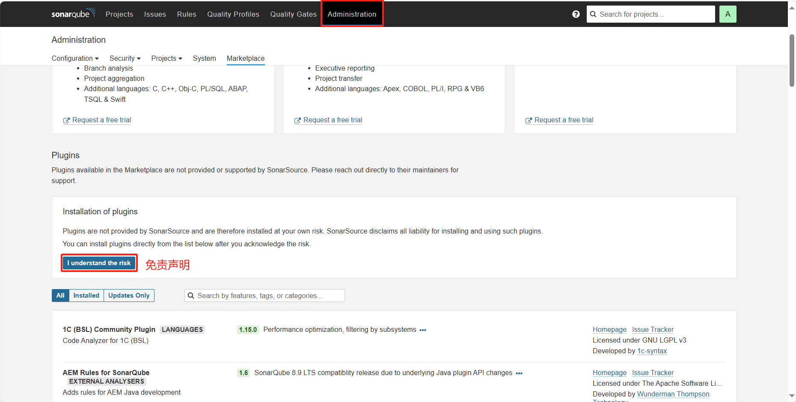
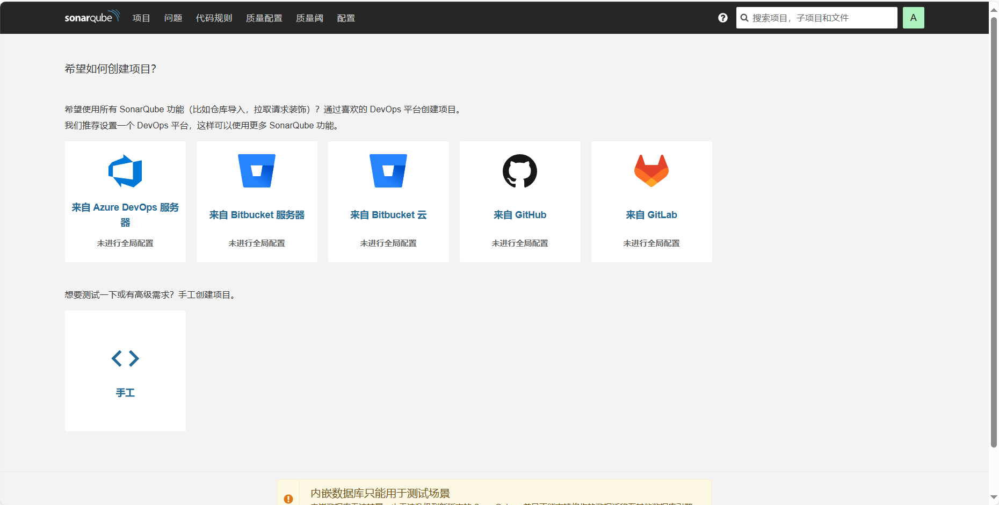
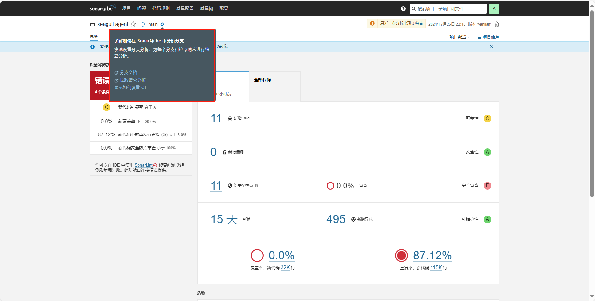
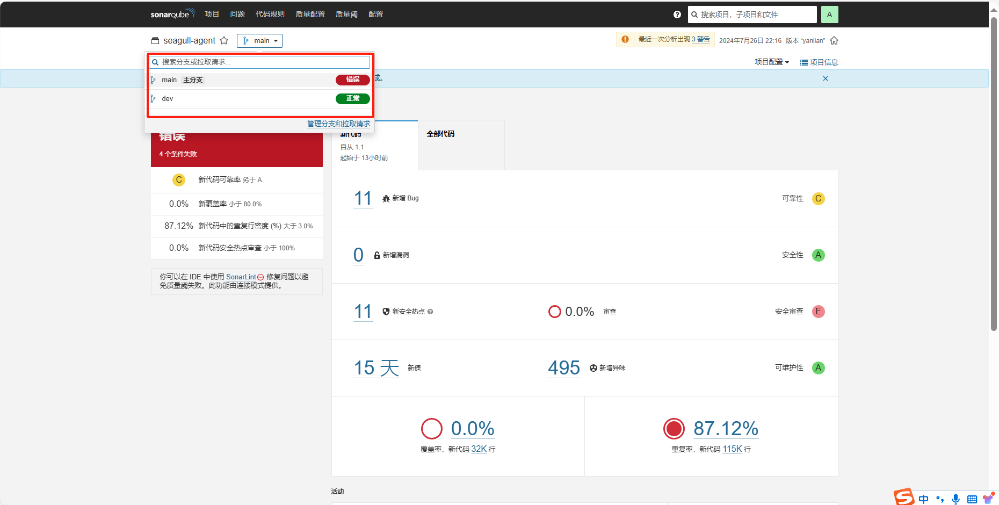

[doc](https://docs.sonarsource.com/sonarqube/9.9/)|[plugin](https://www.sonarplugins.com/)

### 安装sonarQube[服务端]

| 端口 | jdk  |
| ---- | ---- |
| 9000 | 17   |

**安装jdk**

```bash
wget https://download.oracle.com/java/17/archive/jdk-17.0.10_linux-x64_bin.tar.gz
tar xf jdk-17.0.10_linux-x64_bin.tar.gz -C /opt
```

**安装sonar**

```bash
#https://www.sonarsource.com/products/sonarqube/downloads/
wget https://binaries.sonarsource.com/Distribution/sonarqube/sonarqube-9.9.6.92038.zip
```

```
unzip sonarqube-9.9.6.92038.zip -d /opt
ln -svf /opt/{sonarqube-9.9.6.92038,sonarqube}
```

```bash
useradd sonar
chown -R sonar.sonar /opt/sonarqube*
```

**启动服务**

```bash
su - sonar

JAVA_HOME=/opt/jdk-17.0.10
JAVA_JRE=$JAVA_HOME/jre
CLASSPATH=$JAVA_HOME/lib:$JAVA_HOME/jre/lib
PATH=$JAVA_HOME/bin:$JAVA_JRE/bin:$PATH:.

/opt/sonarqube/bin/linux-x86-64/sonar.sh start
```


**登录**

```
http://127.0.0.1:9000
登录：admin
密码：admin
```


#### 插件安装



重启服务后界面展示为中文简体

离线安装插件
```bash
cd /opt/sonarqube/extensions/downloads/
wget https://github.com/xuhuisheng/sonar-l10n-zh/releases/download/sonar-l10n-zh-plugin-9.9/sonar-l10n-zh-plugin-9.9.jar

# 重启服务后，downloads/ 下的jar 包会被加载到 plugins/
ls /opt/sonarqube/extensions/downloads/
ls /opt/sonarqube/extensions/plugins/
```


### 安装sonarscaner[客户端]

内置了jre
https://docs.sonarsource.com/sonarqube/9.9/analyzing-source-code/scanners/sonarscanner/

```bash
wget https://binaries.sonarsource.com/Distribution/sonar-scanner-cli/sonar-scanner-cli-6.1.0.4477-linux-x64.zip
unzip sonar-scanner-cli-6.1.0.4477-linux-x64.zip -d /opt
ln -svf /opt/{sonar-scanner-6.1.0.4477-linux-x64,sonar-scanner}
```


```bash
export SONAR_SCANNER_HOME=/opt/sonar-scanner
export PATH=${SONAR_SCANNER_HOME}/bin:$PATH
export SONAR_SCANNER_OPTS="-Xmx512m"

[root@192 ~]# sonar-scanner -v
21:37:07.202 INFO  Scanner configuration file: /opt/sonar-scanner-6.1.0.4477-linux-x64/conf/sonar-scanner.properties
21:37:07.209 INFO  Project root configuration file: NONE
21:37:07.244 INFO  SonarScanner CLI 6.1.0.4477
21:37:07.248 INFO  Java 17.0.11 Eclipse Adoptium (64-bit)
21:37:07.250 INFO  Linux 3.10.0-957.el7.x86_64 amd64
```


### 执行代码扫描

| 参数                     | 解释                     |
| ------------------------ | ------------------------ |
| sonar.host.url           | sonarQube的服务器地址    |
| sonar.projectKey         |                          |
| sonar.projectName        | 项目名称                 |
| sonar.projectVersion     | 项目版本                 |
| sonar.login              | sonarQube用户名          |
| sonar.password           | sonarQube密码            |
| sonar.ws.timeout         | 超时时间                 |
| sonar.projectDescription | 项目描述                 |
| sonar.links.homepage     | 超级链接（gitlab）       |
| sonar.links.ci           | 超级链接（jenkins）      |
| sonar.sources            | 代码目录                 |
| sonar.sourceEncoding     | 字符编码                 |
| sonar.java.binaries      | java代码编译后的文件目录 |

#### 通过命令行扫描

**扫描 java 代码**

```bash
sonar-scanner \
-Dsonar.host.url=http://192.168.0.246:9000 \  
-Dsonar.projectKey=seagull-api \
-Dsonar.projectName=seagull-api \
-Dsonar.projectVersion=1.1 \
-Dsonar.login=admin \
-Dsonar.password=pytc@2024 \
-Dsonar.ws.timeout=30 \
-Dsonar.projectDescription='my first project!' \
-Dsonar.links.homepage=http://192.168.0.246:8076/devops/seagull-core \
-Dsonar.links.ci=http://192.168.1.200:8080/job/demo-pipeline-service/ \
-Dsonar.sources=src \
-Dsonar.sourceEncoding=UTF-8 \
-Dsonar,java.binaries=target/classes \
-Dsonar.java.test.binaries=target/test-classes \
-Dsonar.java.surefire.report=target/surefire-reports 
```

**扫描 js 代码**

```bash
sonar-scanner \
-Dsonar.host.url=http://192.168.0.246:9000 \
-Dsonar.projectKey=seagull-webui \
-Dsonar.projectName=seagull-webui \
-Dsonar.projectVersion=1.1 \
-Dsonar.login=admin \
-Dsonar.password=pytc@2024 \
-Dsonar.ws.timeout=30 \
-Dsonar.projectDescription='seagull-webui' \
-Dsonar.links.homepage=https://e.gitee.com/bj-pytc/repos/bj-pytc/pcloud-webui/sources \
-Dsonar.links.ci=http://175.178.65.213:18080/job/seagull-ui/job/seagull-ui/ \
-Dsonar.sources=src \
-Dsonar.sourceEncoding=UTF-8
```

**扫描 golang 代码**

```bash
sonar-scanner \
-Dsonar.host.url=http://192.168.0.246:9000 \
-Dsonar.projectKey=seagull-core \
-Dsonar.projectName=seagull-core \
-Dsonar.projectVersion=1.1 \
-Dsonar.login=admin \
-Dsonar.password=pytc@2024 \
-Dsonar.ws.timeout=30 \
-Dsonar.projectDescription='seagull-core' \
-Dsonar.links.homepage=https://e.gitee.com/bj-pytc/repos/bj-pytc/pcloud-core/sources \
-Dsonar.links.ci=http://175.178.65.213:18080/job/seagull-core/job/seagull-core-test/ \
-Dsonar.sourceEncoding=UTF-8
```

```bash
sonar-scanner \
-Dsonar.host.url=http://192.168.0.246:9000 \
-Dsonar.projectKey=seagull-agent \
-Dsonar.projectName=seagull-agent \
-Dsonar.projectVersion=1.1 \
-Dsonar.login=admin \
-Dsonar.password=pytc@2024 \
-Dsonar.ws.timeout=30 \
-Dsonar.projectDescription='seagull-agent' \
-Dsonar.links.homepage=https://e.gitee.com/bj-pytc/repos/bj-pytc/pcloud-agent/sources \
-Dsonar.links.ci=http://175.178.65.213:18080/job/seagull-agent/job/seagull-agent/ \
-Dsonar.sourceEncoding=UTF-8
```

#### 通过配置文件扫描

>  文件命名为`sonar-project.properties`, 并把该文件放置在git代码根目录下，此时只需要执行 **sonar-scanner** 命令即会加载该配置文件执行扫描

```bash
cat >sonar-project.properties <<EOF
sonar.host.url=http://192.168.0.246:9000
sonar.projectKey=seagullagent
sonar.projectName=seagull-agent
sonar.projectVersion=1.1
sonar.login=admin
sonar.password=pytc@2024
sonar.ws.timeout=30
sonar.projectDescription='seagull-agent'
sonar.links.homepage=https://e.gitee.com/bj-pytc/repos/bj-pytc/pcloud-agent/sources
sonar.links.ci=http://175.178.65.213:18080/job/seagull-agent/job/seagull-agent/
sonar.sourceEncoding=UTF-8
EOF
```


#### 多分支扫描插件

> 社区版本默认无法支持多分支扫描


##### Sonarqube配置

1. 下载扫描插件到 `/opt/sonarqube/extensions/plugins/`：

   ```bash
   wget https://github.com/mc1arke/sonarqube-community-branch-plugin/releases/download/1.14.0/sonarqube-community-branch-plugin-1.14.0.jar -P /opt/sonarqube/extensions/plugins/
   ```

   

2. 配置sonarqube配置文件：`/opt/sonarqube/conf/sonar.properties` 添加以下内容：

   ```bash
   sonar.web.javaAdditionalOpts=-javaagent:./extensions/plugins/sonarqube-community-branch-plugin-1.14.0.jar=web
   sonar.ce.javaAdditionalOpts=-javaagent:./extensions/plugins/sonarqube-community-branch-plugin-1.14.0.jar=ce
   ```

   

3. 重启soanrqube,看到如下信息表示成功
   
##### sonar-scanner配置

新增扫描配置 `-Dsonar.branch.name=dev`

```
export SONAR_SCANNER_HOME=/opt/sonar-scanner
export PATH=${SONAR_SCANNER_HOME}/bin:$PATH
```


```bash
sonar-scanner \
-Dsonar.host.url=http://192.168.0.246:9000 \
-Dsonar.projectKey=seagull-agent \
-Dsonar.projectName=seagull-agent \
-Dsonar.projectVersion=1.1 \
-Dsonar.login=admin \
-Dsonar.password=pytc@2024 \
-Dsonar.ws.timeout=30 \
-Dsonar.projectDescription='seagull-agent' \
-Dsonar.links.homepage=https://e.gitee.com/bj-pytc/repos/bj-pytc/pcloud-agent/sources \
-Dsonar.links.ci=http://175.178.65.213:18080/job/seagull-agent/job/seagull-agent/ \
-Dsonar.sourceEncoding=UTF-8 \
-Dsonar.branch.name=dev
```
扫描结果可以看到具体的分支信息


#### 依赖插件安全扫描

[jeremylong/DependencyCheck: OWASP dependency-check is a software composition analysis utility that detects publicly disclosed vulnerabilities in application dependencies. (github.com)](https://github.com/jeremylong/DependencyCheck/tree/main)

[dependency-check/dependency-check-sonar-plugin：将 Dependency-Check 报告集成到 SonarQube 中 (github.com)](https://github.com/dependency-check/dependency-check-sonar-plugin)

[SonarQube集成DependencyCheck - Open-Source Security Architecture (bloodzer0.github.io)](https://bloodzer0.github.io/ossa/other-security-branch/devsecops/sdc/)

[dependency-check – Internet Access Required (jeremylong.github.io)](https://jeremylong.github.io/DependencyCheck/data/index.html)


### 附件

#### docker 启动

```bash
sonarqube_data: 包含数据文件，例如嵌入式 H2 数据库和 Elasticsearch 索引
sonarqube_logs: 包含有关访问、Web 进程、CE 进程和 Elasticsearch 的 SonarQube 日志
sonarqube_extensions: 将包含您安装的所有插件和 Oracle JDBC 驱动程序（如有必要）
docker run --rm -p 9000:9000 sonarqube:lts-community
```

```bash
docker run --rm \
-p 9000:9000 \
-e JDBC_URL="jdbc:postgresql://127.0.0.1:5432/sonarqube" \
-v sonarqube_conf:/opt/sonarqube/conf \
-v sonarqube_logs:/opt/sonarqube/logs \
-v sonarqube_data:/opt/sonarqube/data \
-v sonarqube_extensions:/opt/sonarqube/extensions \
 sonarqube:8.9.2-community
```

#### [sonarQube api](http://175.178.65.213:9000/web_api)

| 用途               | api                                                      | 版本  | 方法 |
| ------------------ | -------------------------------------------------------- | ----- | ---- |
| prometheus格式监控 | api/monitoring/metrics                                   | >=9.3 | GET  |
| 查找项目           | api/projects/search?projects=seagull-agent               | >=6.3 | GET  |
| 创建项目           | api/projects/create?project=seagull-api&name=seagull-api | >=4.0 | POST |
| 删除项目           | api/projects/delete?project=seagull-agent                | >=5.2 | POST |


