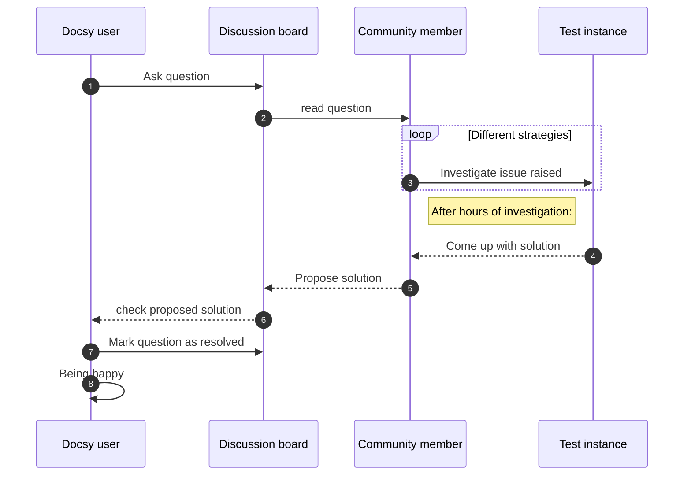
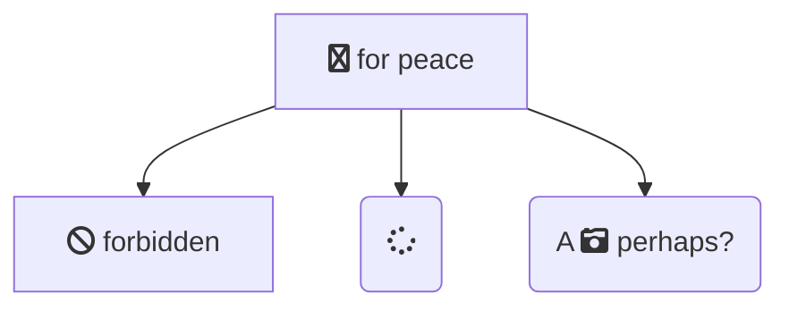

{}

- 安装、配置hugo&docsy环境

  

{}



  {}
  {}

1. `go version 1.18+`

2. `nodejs`

   ```bash
   npm install -D autoprefixer
   npm install -D postcss-cli
   npm install -D postcss
   ```

3. `hugo_extended  version 0.110.0+`

4. `git`


  {}
  {}

```bash
cat > hugo.yaml <<EOL
enableEmoji: true # 支持emoji
module:
  proxy: direct
  hugoVersion:
    extended: true
    min: 0.73.0
  imports:
    - path: github.com/google/docsy
      disable: false
markup:
  goldmark:
    renderer:
      unsafe: true                  # 支持markdown 中html css的解析
    cjk:                            # 中文配置
      enable: true
      eastAsianLineBreaks: true     # 按中文换行规则
      escapedSpace: true            # 保留空格转义

EOL
```

```bash
hugo new site my-new-site --format yaml
cd  my-new-site
git init
hugo mod init github.com/me/my-new-site
hugo mod get github.com/google/docsy@v0.11.0

#
hugo server
```

  

  {}



### 初始化顶级菜单 

`hugo.yaml`
```yaml
menu:
  main:
    - name: 关于
      weight: 100
      url: '/about'
      pre: <i class="fa-solid fa-house"></i> # 图标 https://fontawesome.com/

    - name: 文档
      weight: 200
      url: '/docs'
      pre: <i class="fa-solid fa-book"></i>

    - name: 博客
      weight: 300
      url: '/blog'
      pre: <i class="fa-solid fa-blog"></i>

    - weight: 400
      url: 'https://github.com/google/docsy/'
      pre: <i class='fa-brands fa-github'></i>
```

### 增加内容页面

网站content目录结构
```bash
content
├─_index.md
├─about.md
├─blog
|  |_ _index.md
└─docs
    |- _index.md
    ├─golang
    |  |- _index.md
    |  |_ package
    |       |_ _index.md
    └─hugo
       |_ _index.md
```

**_index.md**文件至关重要，负责初始化目录结构。以下是相对于content目录下创建的_index.md文件内容:


  {}
  {}
```yaml
---
title: "HOME"
---
```
  {}
  {}
```yaml
---
title: "docs"
---
```
  {}

  {}
```yaml
---
title: ""
linkTitle: "hugo"
date: 2025-05-09
simple_list: true
weight: 3
description: >
  hugo 文档中心
icon: fa-solid fa-screwdriver-wrench
---
```
  {}
  {}

```yaml
---
title: ""
linkTitle: "golang"
date: 2025-05-09
simple_list: true
weight: 5
description: >
  golang 文档中心
icon: fa-brands fa-golang
---
```
  {}



新增加第一个页面 `content/docs/hugo/hugo.md`
```bash
hugo new content docs/hugo/hugo.md -k blog
```
```yaml
---
title: "建站"
linkTitle: "建站"
date: 2025-05-09

toc_hide: false     #隐藏左侧菜单
hide_summary: true  #隐藏描述，在内容页面的front matter中并没有看出来效果。_index.md 可以清楚的看到效果
weight: 3
description: >
  使用hugo & docsy 构建站点
---

《请书写你的内容》
```

在章节菜单中例如*content/docs* 下，默认会展开所有内容，通过以下参数对该区域进行控制:

hugo.yaml
```yaml
params:
  ui:
    sidebar_menu_compact: true  #只展开当前章节，其他兄弟章节折叠
    ul_show: 1                  #展开侧边栏中一级内容，嵌套更深的菜单项初始化处于折叠状态
    sidebar_menu_foldable: true #允许手动点击父菜单项实现展开/折叠
    sidebar_cache_limit: 1000   #侧边栏生成时的缓存条目限制，加快渲染
```

为了简化页面,可以禁用面包屑导航的
```yaml
params:
  ui:
    breadcrumb_disable: true        #Docsy 主题默认会在页面顶部（位于标题下方）生成一个面包屑导航，显示当前页面的层级路径，例如: hugo/建站。此配置用于禁用
    taxonomy_breadcrumb_disable: true #例如 tags 或 categories 的列表页或详情页）默认也会显示面包屑导航. 此配置用于禁用
```

页面设置，同样可以在页面 front matter 中设置页面的图标

> 位置：_index.md 或 <具体文档>.md

```yaml
---
icon: fa-solid fa-screwdriver-wrench  # 图标 https://fontawesome.com/
---
```

### 本地搜索

hugo.yaml

```yaml
params:
  offlineSearch: true
  offlineSearchSummaryLength: 200
  offlineSearchMaxResults: 25
```


### Mermaid 渲染

hugo.yaml
```yaml
params:
  mermaid:
    version: 10.9.0
```

示例：




{}
由于hugo(hugo v0.146.7)版本问题，引入了try方法处理错误，原有的语法不在兼容，因此需要覆盖模版配置:
{}


layouts\partials\scripts\mermaid.html
```html


{{ $version := .Site.Params.mermaid.version | default "latest" -}}

{{ $cdnurl := printf "https://cdn.jsdelivr.net/npm/mermaid@%s/dist/mermaid.esm.min.mjs" $version -}}

{{ with try (resources.GetRemote $cdnurl) }}
  {{ with .Err -}}
    {{ errorf "Could not retrieve mermaid script from CDN. Reason: %s." . -}}
  {{ end -}}
{{ else -}}
  {{ errorf "Invalid Mermaid version %s, could not retrieve this version from CDN." $version -}}
{{ end -}}

<script type="module" async>
  import mermaid from "{{ $cdnurl }}";

  (function ($) {
    if ($('.mermaid').length == 0) {
      mermaid.initialize({ startOnLoad: false });
      return;
    }

    var params = {{ with .Site.Params.mermaid }}{{ . | jsonify | safeJS }}{{ else }}{}{{- end }};

    // Site params are stored with lowercase keys; lookup correct casing
    // from Mermaid default config.
    var norm = function (defaultConfig, params) {
      var result = {};
      for (const key in defaultConfig) {
        const keyLower = key.toLowerCase();
        if (defaultConfig.hasOwnProperty(key) && params.hasOwnProperty(keyLower)) {
          if (typeof defaultConfig[key] === "object") {
            result[key] = norm(defaultConfig[key], params[keyLower]);
          } else {
            result[key] = params[keyLower];
          }
        }
      }
      return result;
    };

    var settings = norm(mermaid.mermaidAPI.defaultConfig, params);
    settings.startOnLoad = true;
    if ($('html[data-bs-theme="dark"]').length) {
      settings.theme = 'dark';
    }
    mermaid.initialize(settings);

    // Handle light/dark mode theme changes
    const lightDarkModeThemeChangeHandler = function (mutationsList, observer) {
      for (const mutation of mutationsList) {
        if (mutation.type === 'attributes' && mutation.attributeName === 'data-bs-theme') {
          // Mermaid doesn't currently support reinitialization, see
          // https://github.com/mermaid-js/mermaid/issues/1945. Until then,
          // just reload the page.
          location.reload();
        }
      }
    };

    const observer = new MutationObserver(lightDarkModeThemeChangeHandler);
    observer.observe(document.documentElement, {
      attributes: true,
      attributeFilter: ['data-bs-theme']
    });
    // observer.disconnect();

  })(jQuery);
</script>

```

### 外观设置

`hugo.yaml`开启light/dark 模式的切换
```yaml
params:
  ui:
    showLightDarkModeMenu: true
```

`hugo.yaml`支持打印页面

```yaml
outputs:
  section:
    - HTML
    - RSS
    - print
```

### 新标签页打开外部链接

位置：`layouts/_default/_markup/render-link.html`
```html
<a href="{{ .Destination | safeURL }}"{{ with .Title}} title="{{ . }}"{{ end }}{{ if strings.HasPrefix .Destination "http" }} target="_blank"{{ end }}>{{ .Text }}</a>
```


### 评论系统

评论系统：[Waline | Waline](https://waline.js.org/)