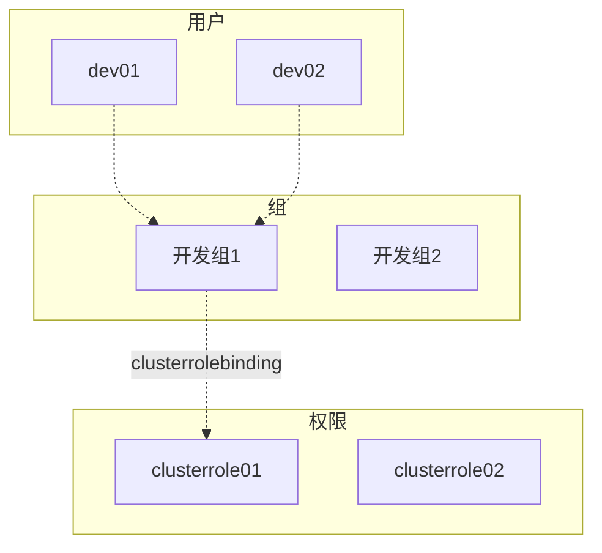

**任务需求：**

为开发人员设置k8s集群权限

**设计思路：**

将开发人员按照产品线分成小组，授予小组对应权限，开发人员加入到对应组实现授权。




**功能实现：**

1. 允许同一用户加入多个组
2. 用户权限回收
3. 人员异动，权限调整
4. 实现操作审计（k8s审计日志）


**实施步骤：**

1. 设计`clusterrole` 权限
2. 设计组，把`clusterrole` 绑定到组中
3. 新增用户，并生成kubeconfig文件
4. 用户权限的回收【停用】
5. 人员异动权限调整【调整用户所属组，无法做到动态调整只能停用用户重新创建】


**实践案例：**

> 该案例用于理清思路，并不实用

1. 设计`clusterrole` 权限

   *使用默认权限 `cluster:admin`*

   

2. 设计组，把`clusterrole` 绑定到组中

   *使用默认组 `system:masters`*

   

3. 新增用户，并生成`kubeconfig`文件

   ```bash
   openssl genrsa -out user01.key 1024
   openssl req -new -key user01.key -out user01.csr -subj /CN=user01/O=system:masters
   ```

   ```bash
   openssl x509 -req -CA /etc/kubernetes/pki/ca.crt -CAkey /etc/kubernetes/pki/ca.key -in user01.csr -out user01.crt -days 3650 -CAcreateserial
   ```

   ```bash
   openssl x509 -in user01.crt -text
   ```

   ```bash
   # 设置集群信息
   kubectl config set-cluster kubernetes \
   --certificate-authority=/etc/kubernetes/pki/ca.crt \
   --embed-certs=true \
   --server=https://10.4.7.10:6443 \
   --kubeconfig=user01.kubeconfig
   ```

   ```bash
   # 设置用户信息
   kubectl config set-credentials user01 \
   --client-certificate=./user01.crt \
   --client-key=./user01.key \
   --embed-certs=true \
   --kubeconfig=user01.kubeconfig
   ```

   ```bash
   # 把集权和用户信息绑定
   kubectl config set-context user01@kubernetes \
   --cluster=kubernetes \
   --user=user01 \
   --kubeconfig=user01.kubeconfig
   ```

   ```bash
   # current-context
   kubectl config use-context user01@kubernetes \
   --kubeconfig=user01.kubeconfig
   ```

   ```bash
   root@master01:~/user01# kubectl get nodes --kubeconfig=./user01.kubeconfig
   NAME       STATUS   ROLES           AGE   VERSION
   master01   Ready    control-plane   22d   v1.28.2
   ```

   ---

   

   以上已经完成了用户的新增及授权动作，为了便于理解我们再次新增用户user02

   ```bash
   openssl genrsa -out user02.key 1024
   openssl req -new -key user02.key -out user01.csr -subj /CN=user02/O=system:masters
   ```

   ```bash
   openssl x509 -req -CA /etc/kubernetes/pki/ca.crt -CAkey /etc/kubernetes/pki/ca.key -in user01.csr -out user02.crt -days 3650 -CAcreateserial
   ```

   ```bash
   openssl x509 -in user02.crt -text
   ```

   

   

   ```bash
   # 设置用户信息
   kubectl config set-credentials user02 \
   --client-certificate=./user02.crt \
   --client-key=./user02.key \
   --embed-certs=true \
   --kubeconfig=user01.kubeconfig
   ```

   ```bash
   # 把集权和用户信息绑定
   kubectl config set-context user02@kubernetes \
   --cluster=kubernetes \
   --user=user02 \
   --kubeconfig=user01.kubeconfig
   ```

   

   ```
   kubectl config use-context user02@kubernetes --kubeconfig=./user01.kubeconfig
   ```

   ```bash
   root@master01:~/user01# kubectl get nodes --kubeconfig=./user01.kubeconfig
   NAME       STATUS   ROLES           AGE   VERSION
   master01   Ready    control-plane   22d   v1.28.2
   ```

   ---

   

   以上创建的过程比较复杂，kubectl的插件功能实现了功能的简化：

   
   
   希望实现的调用方式：
   
   ```bash
   kubectl rbac --user=user01 --clusterrole=cluser-admin --kubeconfigfile=user01.kubeconfig
   ```
   
   
   
   ```bash
   cat /usr/local/bin/kubectl-rbac
   
   #!/bin/bash
   
   createuser(){
           openssl genrsa -out user01.key 1024
           openssl req -new -key user01.key -out user01.csr -subj /CN=user02/O=system:masters
           openssl x509 -req -CA /etc/kubernetes/pki/ca.crt -CAkey /etc/kubernetes/pki/ca.key -in user01.csr -out user01.crt -days 3650 -CAcreateserial
   }
   
   createkubeconfig(){
   # 设置集群信息
   kubectl config set-cluster kubernetes \
   --certificate-authority=/etc/kubernetes/pki/ca.crt \
   --embed-certs=true \
   --server=https://10.4.7.10:6443 \
   --kubeconfig=user01.kubeconfig
   
   # 设置用户信息
   kubectl config set-credentials user01 \
   --client-certificate=user01.crt \
   --client-key=user01.key \
   --embed-certs=true \
   --kubeconfig=user01.kubeconfig
   
   # 把集权和用户信息绑定
   kubectl config set-context user01@kubernetes \
   --cluster=kubernetes \
   --user=user01 \
   --kubeconfig=user01.kubeconfig
   
   # current-context
   kubectl config use-context user01@kubernetes \
   --kubeconfig=user01.kubeconfig
   }
   
   check(){
   kubectl get nodes --kubeconfig=./user01.kubeconfig
   }
   
   createuser
   createkubeconfig
   check
   ```
   
