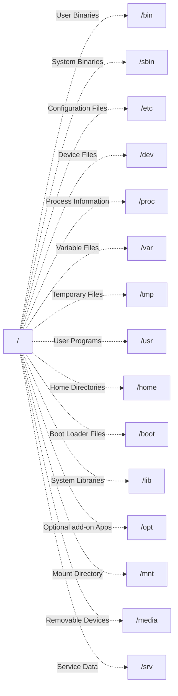

```mermaid
graph LR
    A["/"] -.->|User Binaries| B["/bin"]
    A -.->|System Binaries| C["/sbin"]
    A -.->|Configuration Files| D["/etc"]
    A -.->|Device Files| E["/dev"]
    A -.->|Process Information| F["/proc"]
    A -.->|Variable Files| G["/var"]
    A -.->|Temporary Files| H["/tmp"]
    A -.->|User Programs| I["/usr"]
    A -.->|Home Directories| J["/home"]
    A -.->|Boot Loader Files| K["/boot"]
    A -.->|System Libraries| L["/lib"]
    A -.->|Optional add-on Apps| M["/opt"]
    A -.->|Mount Directory| N["/mnt"]
    A -.->|Removable Devices| O["/media"]
    A -.->|Service Data| P["/srv"]
```