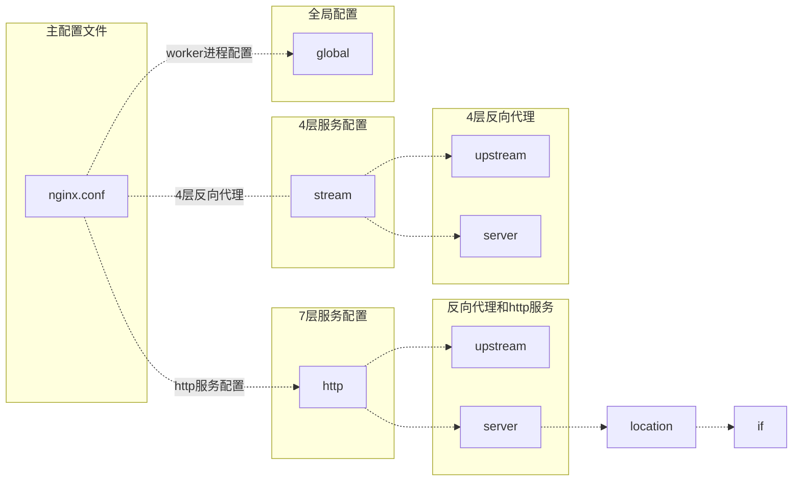

---

nginx 进程关系： nginx 由master和worker进程组成，master进程负责管理work进程，worker进程负责处理具体的任务.


配置文件结构：



### 配置模板


```nginx
# 进程模式启动
daemon on;
# master worker 模式运行
master_process on;
# 错误日志设置 日志路径   日志记录级别（debug info notice warn error crit alert emerg）
error_log logs/error.log error;
user  nginx;
worker_processes 4;
worker_cpu_affinity 0001 0010 0100 1000;

#worker_processes 8;
#worker_cpu_affinity 0001 0010 0100 1000 0001 0010 0100 1000;

events {
    # 批量建立连接
    multi_accept on;
    # 对指定客户端执行debug,需要在编译时 --with-debug,否则不生效
    debug_connection 127.0.0.1;
    debug_connection 192.168.0.0/24;
    # 使用epoll i/o模型
    use epoll;
    # 单个进程最大连接数
    worker_connections 15000;  
}

# 指定work进程打开的最大文件数，可设置为系统ulimit -HSn的结果
worker_rlimit_nofile 65535;

# 4层代理
stream {
        log_format main '$remote_addr [$time_local] '
             '$protocol $status $bytes_sent $bytes_received '
             '$session_time "$upstream_addr" '
             '"$upstream_bytes_sent" "$upstream_bytes_received" "$upstream_connect_time"';
        upstream mysql {
                server 172.16.100.10:3306 weight=1 max_fails=3 fail_timeout=30s;
                server 172.16.100.11:3306 weight=1 max_fails=3 fail_timeout=30s;
                server 172.16.100.12:3306 weight=1 max_fails=3 fail_timeout=30s;
        }
        server {
                listen 3306;
                proxy_connect_timeout 2s;
                proxy_timeout 900s;
                proxy_pass mysql;
                access_log  /dev/stdout main;
          }
}


http {
    include       mime.types;
    default_type  application/octet-stream;
    server_tokens off;
    # 指定字符集
    charset utf-8;
    #sendfile参数控制文件高效传输模式，同时将tcp_nopush和tcp_nodelay设置为on防止网络阻塞
    sendfile on;
    tcp_nopush on;
    #在keepalive开启才有效
    tcp_nodelay on;
    #设置客户端保持会话的时间
    keepalive_timeout 60;
    #设置客户端请求头读取超时时间，如果超过这个时间，客户端还没有发送任何数据，nginx将返回"request time out(408)"错误
    client_header_timeout 15;
    #设置客户端请求主体读取超时时间，如果超过这个时间，客户端还没有发送任何数据，nginx将返回"request time out(408)"错误，默认时长60
    send_timeout 60;
    ################################
    #开启压缩
    gzip on;
    #压缩对象的最小大小（小于1k不压缩）
    gzip_min_length 1k;
    #压缩缓冲区，申请4个单位为16k的内存空间作为缓冲区
    gzip_buffers 4 16k;
    #压缩版本(默认1.1，前端为squid2.5时使用1.0)用于设置识别http协议版本，
    gzip_http_version 1.0;
    #压缩比例 1压缩比最小 9压缩比最大
    gzip_comp_level 6;
    #指定压缩的类型，"text/html"类型总是被压缩.类型cat mime.types
    gzip_types text/plain application/x-javascript text/css application/xml 
    #告诉前端缓存服务器不要解压，到客户端时才解压.发送vary:Accept_Enconding 响应头字段，从而通知接收方我做了gzip 压缩
    gzip_vary on;
    # nginx做反向代理时，按照后端web服务器的压缩策略设置gzip 参数
    gzip_proxied any;
    # 关闭对ie6 的压缩
    gzip_disable "msie6";

    server_names_hash_max_size  1024;  
    server_names_hash_bucket_size   512;

    # 七层代理
    upstream backend {
        # backup 当其他主机失败后使用该主机，不能用在 hash ip_hash 和random 调度算法中
        # down 当前主机不可用，当使用ip_hash 中标记为down不会影响hash值
        server 172.16.100.10:8080 weight=1 max_fails=3 fail_timeout=30s;
        server 172.16.100.11:8080 weight=1 max_fails=3 fail_timeout=30s;
        server 172.16.100.12:8080 weight=1 max_fails=3 fail_timeout=30s;
    
        server 172.16.100.13:8080   backup;
        server 172.16.100.14:8080   backup;
    }

    server {
        # 设置X-Real-IP头，让服务端看到客户端的真实IP地址。
        proxy_set_header  X-Real-IP $remote_addr;
        # 设置X-Forwarded-For头，添加原始请求的IP地址
        proxy_set_header  X-Forwarded-For $remote_addr;
        # 设置代理请求的Host头，使用请求的原始主机名
        proxy_set_header Host $host;
        # 设置客户端请求的最大body大小为50MB
        client_max_body_size 50m;
        # 设置客户端请求body的缓冲区大小为256KB
        client_body_buffer_size 256k;
        location /backend {
        
            proxy_pass http://backend;
        
        }
    }

    server {
        listen       80;
        server_name  localhost;

        location / {
            root   html;
            index  index.html index.htm;
        }
        
        error_page   500 502 503 504  /50x.html;
        location = /50x.html {
            root   html;
        }
    }
}
```



### 参数解释
**cup亲和力绑定**

{}
位置：全局 `global` 指令下
{}


配置示例:
```nginx
worker_processes 4;
worker_cpu_affinity 0001 0010 0100 1000;

#worker_processes 8;
#worker_cpu_affinity 0001 0010 0100 1000 0001 0010 0100 1000;
```

**事件模型优化**

{}
位置：全局 `global` 中`events`指令下

推荐：
      在linux中使用`epoll`模型；
      在freebsd中使用`kqueue`模型；
      在solaris中使用`/dev/poll`的模式；
      在windows中使用`icop`模型
{}


配置示例:
```nginx
events {
    use epoll;
    #单个进程最大连接数
    worker_connections  2048;  
}
```


**单个worker可以打开的最大文件描述符**

{}
位置：全局 `global` 指令下
{}

配置示例:

```nginx
#指定work进程打开的最大文件数，可设置为系统ulimit -HSn的结果
worker_rlimit_nofile 65535;
```