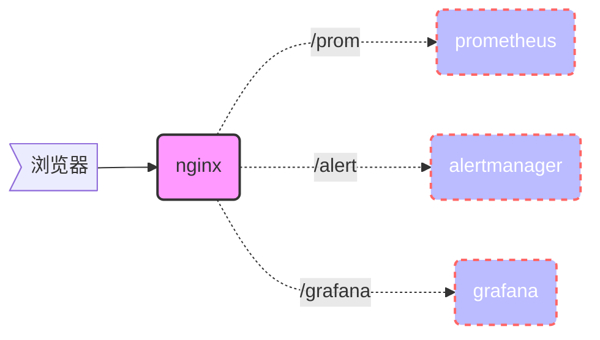

nginx 是一个高性能的HTTP和反向代理服务器，本章主要介绍nginx的http服务器配置。


### 基于ip的多虚拟机


```nginx
worker_processes  1;

events {
    worker_connections  1024;
}

http {
    include       mime.types;
    default_type  application/octet-stream;
    sendfile        on;
    keepalive_timeout  65;

    # 服务一
    server {
        listen       192.168.0.106:80;
        server_name  localhost;

        location / {
            root   html;
            index  index.html index.htm;
        }


        error_page   500 502 503 504  /50x.html;
        location = /50x.html {
            root   html;
        }
    }

    # 服务二
    server {
        listen       192.168.0.236:80;
        server_name  localhost;

        location / {
            root   html;
            index  index.html index.htm;
        }


        error_page   500 502 503 504  /50x.html;
        location = /50x.html {
            root   html;
        }    
    }
}
```


### 基于端口的多虚拟机


```nginx
worker_processes  1;

events {
    worker_connections  1024;
}

http {
    include       mime.types;
    default_type  application/octet-stream;
    sendfile        on;
    keepalive_timeout  65;

    # 服务一
    server {
        listen       80;
        server_name  localhost;

        location / {
            root   html;
            index  index.html index.htm;
        }


        error_page   500 502 503 504  /50x.html;
        location = /50x.html {
            root   html;
        }
    }

    # 服务二
    server {
        listen       81;
        server_name  localhost;

        location / {
            root   html;
            index  index.html index.htm;
        }


        error_page   500 502 503 504  /50x.html;
        location = /50x.html {
            root   html;
        }    
    }
}
```


### 基于域名的多虚拟机



```nginx
worker_processes  1;

events {
    worker_connections  1024;
}

http {
    include       mime.types;
    default_type  application/octet-stream;
    sendfile        on;
    keepalive_timeout  65;

    # 服务一
    server {
        listen       80;
        server_name  docs.zero-dew.com;

        location / {
            root   html;
            index  index.html index.htm;
        }


        error_page   500 502 503 504  /50x.html;
        location = /50x.html {
            root   html;
        }
    }

    # 服务二
    server {
        listen       80;
        server_name  blog.zero-dew.com;

        location / {
            root   html;
            index  index.html index.htm;
        }


        error_page   500 502 503 504  /50x.html;
        location = /50x.html {
            root   html;
        }    
    }
}
```



### 基于用户名密码的简单认证


生成用户名和密码
```bash
echo user01:`openssl passwd 456` >>/opt/nginx/passwd
echo user02:`openssl passwd 456` >>/opt/nginx/passwd
```

```nginx
worker_processes  1;
events {
    worker_connections  1024;
}

http {
    include       mime.types;
    default_type  application/octet-stream;
    sendfile        on;
    keepalive_timeout  65;

    server {
        listen       80;
        server_name  localhost;
        location / {
            root   html;
            index  index.html index.htm;
            ####
            auth_basic "Restricted Content";  
            auth_basic_user_file passwd;
            ####
        }
      
        error_page   500 502 503 504  /50x.html;
        location = /50x.html {
            root   html;
        }
    }
}
```



### 基于SSL的HTTPS服务

生成证书
```bash
mkdir /opt/nginx/conf/ssl
cd /opt/nginx/conf/ssl
openssl genrsa -out server.key 2048
openssl req -new -key server.key -out server.csr -subj "/C=CN/ST=GD/L=SZ/O=zero-dew.com/CN=docs.zero-dew.com"
openssl x509 -req -in server.csr -out server.crt -signkey server.key -days 3650
```

```nginx
worker_processes  1;
events {
    worker_connections  1024;
}

http {
    include       mime.types;
    default_type  application/octet-stream;
    sendfile        on;
    keepalive_timeout  65;

    server {
        listen 80;
        server_name docs.zero-dew.com;
    
        # 所有80端口的请求都重定向到443端口
        location / {
            return 301 https://$host$request_uri;
        }
    }
 
    server {
        listen 443 ssl;
        server_name docs.zero-dew.com;
    
        # 指定SSL证书和私钥的位置
        ssl_certificate ssl/server.crt;
        ssl_certificate_key ssl/server.key;
    
        # SSL会话超时时间
        ssl_session_timeout 10m;
    
        # 指定SSL密码套件，使用安全的加密套件
        ssl_ciphers ECDHE-RSA-AES128-GCM-SHA256:ECDHE:ECDH:AES:HIGH:!NULL:!aNULL:!MD5:!ADH:!RC4;
    
        # 指定支持的TLS协议版本
        ssl_protocols TLSv1 TLSv1.1 TLSv1.2;
    
        # 优先使用服务器指定的密码套件
        ssl_prefer_server_ciphers on;
    
        # 配置HTTPS下的访问规则
        location / {
            root   html;
            index  index.html index.htm;
        }
    }

}
```



### 配置指令解释


**隐藏版本号** 
{}
位置： `http` 指令下
{}

配置示例:
```nginx
server_tokens off;
```

**开启高效文件传输模式**
{}
Nginx的sendfile指令用于控制文件传输的高效模式，同时将tcp_nopush和tcp_nodelay设置为on防止网络阻塞。

位置：`http` 、`server` 或 `location` 指令下
{}

配置示例: 

```nginx
sendfile on;
tcp_nopush on;
tcp_nodelay on;  #在keepalive开启才有效
```

**设置连接超时时间**
{}
位置：`http` 、`server`  指令下
{}

配置示例:
```nginx
#设置客户端保持会话的时间
keepalive_timeout 60;
#设置客户端请求头读取超时时间，如果超过这个时间，客户端还没有发送任何数据，nginx将返回"request time out(408)"错误
client_header_timeout 15;
#设置客户端请求主体读取超时时间，如果超过这个时间，客户端还没有发送任何数据，nginx将返回"request time out(408)"错误，默认时长60
send_timeout 60;
```

**nginx  gzip压缩功能**

{}
位置：`http` 、`server`  指令下
{}

配置示例:
```nginx
#开启压缩
gzip on;
#压缩对象的最小大小（小于1k不压缩）
gzip_min_length 1k;
#压缩缓冲区，申请4个单位为16k的内存空间作为缓冲区
gzip_buffers 4 16k;
#压缩版本(默认1.1，前端为squid2.5时使用1.0)用于设置识别http协议版本，
gzip_http_version 1.0;
#压缩比例 1压缩比最小 9压缩比最大
gzip_comp_level 6;
#指定压缩的类型，"text/html"类型总是被压缩.类型cat mime.types
gzip_types text/plain application/x-javascript text/css application/xml 
#告诉前端缓存服务器不要解压，到客户端时才解压.发送vary:Accept_Enconding 响应头字段，从而通知接收方我做了gzip 压缩
gzip_vary on;
# nginx做反向代理时，按照后端web服务器的压缩策略设置gzip 参数
gzip_proxied any;
# 关闭对ie6 的压缩
gzip_disable "msie6";
```

**浏览器缓存功能**
{}
位置：`http` 、`server` `location` 指令下
{}

配置示例:
```nginx
location ~.*\.(gif|jpg|png|bmp|swf)$
{
    expires 3650d;
}
location ~.*\.(js|css)?$
{
    expires 30d;
}

location ~(roboots.txt) {
        log_not_found off;
        expires 7d;
        break;
}
```


**客户端请求的最大大小**
{}
位置：`http` 、`server` `location` 指令下
{}

配置示例:
```bash
#超过这个值提示 413错误 ，值0=>不控制 
client_max_body_size   16M;
```

**root**

{}

位置：全局 `http, server, location` 指令下

{}


配置示例:

```nginx
location  / {
  root  /var/www/html;
}
```

**server**

{}

位置：全局 `http` 指令下

{}


配置示例:

```nginx
server {}
```


**listen**

{}

位置：全局 `server` 指令下

{}


配置示例:

```nginx
listen 127.0.0.1:8000;
listen 127.0.0.1;
listen 8000;
listen *:8000;
listen localhost:8000;
```

**server_name**

{}

位置：全局 `server ` 指令下

{}

{}
Nginx使用哈希表来快速查找匹配的server块，而这两个参数分别控制哈希表的总容量和每个桶的大小。max_size是哈希表的总槽位数，而bucket_size是每个槽位占用的内存大小


位置： `http` 指令下
{}


{}

`nginx: [warn] could not build optimal server_names_hash, you should increase either server_names_hash_max_size: 512 or server_names_hash_bucket_size: 64; ignoring server_names_hash_bucket_size`
{}

配置示例:

```nginx
server {
	listen 443 ssl;
	# 支持多个
	server_name test1.go.dev test2.go.dev *.python.dev test.dev.*; 
	# 为了提高匹配server_name的速度，nginx将server_name hash后存储,这里设置么个hash桶占用内存的大小
	server_names_hash_bucket_size 128;
	# 该值越大，hash冲突的可能性越小
	server_names_hash_max_size 512;  #必须2的幂次方
}
```


**alias**

{}

位置：全局 `location` 指令下

语法：`alias file-path|directory-path;`

{}


配置示例:

```nginx
# 例如请求 http://127.0.0.1/test/nginx.conf => /etc/nginx/conf/nginx.conf
location /conf {
	aliase /etc/nginx/conf/;
}

# 例如请求 http://127.0.0.1/test/nginx.conf => /etc/nginx/conf/nginx.conf
location ~ ^/test/(\w+)\.(\w+)$ {
	aliase /etc/nginx/$2/$1.$2;
}
```


**index**

{}

位置：全局 `server, location ` 指令下

{}


配置示例:

```nginx
location  / {
  root  /var/www/html;
  index index.html index.php;
}
```


**error_page**

{}

位置：全局 `http server location if ` 指令下

{}


配置示例:

```nginx
location / {
    error_page 404 /404.html;
    error_page 502 503 504 /50x.html;
    error_page 403 http://127.0.0.1/forbidden.html;
    # 如果重定向后仍然与原来的相同，可以使用 如下格式修改状态码
    error_page 404 = 200 /empty.html;
    # 如果不想修改状态码只是想让重定向到另一个location 可以这样写
    error_page 404 = @fetch;
}
location @fetch {
    proxy_pass http://other;
}
```


**autoindex**

{}

模块：`ngx_http_autoindex_module`

位置：全局 `http, server, location` 指令下

{}


配置示例:

```nginx
location  /  {
  autoindex  on;
}
```


**location指令详解**

{}

所属模块：`ngx_http_core_module`

位置：`server、location`

语法：`location [=|~|~*|^~|@] /uri/ { ... }`

{}


| 匹配动作 | 解释                  | 优先级 |
| -------- | --------------------- | ------ |
| =        | 精确匹配             | 1      |
| ^~       | 匹配以xx开头,忽略正则          | 2      |
| /html/   | 匹配目录              | 3      |
| ~        | 匹配正则 区分大小写   | 4      |
| ~*       | 匹配正则 不区分大小写 | 4      |
| /        | 默认规则              | 5      |
| @        | 内部的重定向          |        |


*在location 最经常使用的参数为proxy_pass，接下来参照下图解释proxy_pass中路径拼接规则*
{}
`location /foo { proxy_pass http://host/bar; }`
如果 location 后面没有 /，Nginx 会把请求的 URI 不变地拼接到 proxy_pass 后的地址。


`location /foo/ { proxy_pass http://host/bar/; }`
如果 location 后面有 /，Nginx 会把匹配到的前缀 /foo/ 去掉，然后把剩下的 URI 拼接到 proxy_pass 后的地址

{}

**示例：**





  {}

{}
访问 /prom/graph 时，Nginx 会把 /prom/graph 直接拼接到 http://192.168.0.161:9090/prom 后面，变成http://192.168.0.161:9090/prom/graph
{}

 ```nginx
         location /prom {
            proxy_pass http://192.168.0.161:9090/prom;
            proxy_set_header Host $host;
            proxy_set_header X-Real-IP $remote_addr;
            proxy_set_header X-Forwarded-For $proxy_add_x_forwarded_for;
        }
 ```


{}

访问 /prom/graph 时，Nginx 会把 /prom/graph 直接拼接到 http://192.168.0.161:9090/prom/ 后面，变成http://192.168.0.161:9090/prom//graph
{}

```nginx
        location /prom {
            proxy_pass http://192.168.0.161:9090/prom/;
            proxy_set_header Host $host;
            proxy_set_header X-Real-IP $remote_addr;
            proxy_set_header X-Forwarded-For $proxy_add_x_forwarded_for;
        }
```

  {}
  {}
{}
访问 /prom/graph 时，Nginx 会把 /prom/ 去掉，剩下 graph，拼接到 http://192.168.0.161:9090/prom/ 后面，变成http://192.168.0.161:9090/prom/graph
{}

```nginx
         location /prom/ {
            proxy_pass http://192.168.0.161:9090/prom/;
            proxy_set_header Host $host;
            proxy_set_header X-Real-IP $remote_addr;
            proxy_set_header X-Forwarded-For $proxy_add_x_forwarded_for;
        }
```

{}
访问 /prom/graph 时，Nginx 会把 /prom/ 去掉，剩下 graph，拼接到 http://192.168.0.161:9090/prom 后面，变成http://192.168.0.161:9090/promgraph
{}

```nginx
         location /prom/ {
            proxy_pass http://192.168.0.161:9090/prom;
            proxy_set_header Host $host;
            proxy_set_header X-Real-IP $remote_addr;
            proxy_set_header X-Forwarded-For $proxy_add_x_forwarded_for;
        }
```
  {}
  {}
默认情况下，nginx会将请求转发到后端的服务器上，而不会将请求的路径进行修改。如果需要将请求的路径进行修改，可以使用  `proxy_redirect` 指令。

 ```nginx
        location = /abc {
            return 301 /abc/;
        }

        location /abc/ {
            proxy_pass http://192.168.0.161:9090/prom/;
            proxy_set_header Host $host;
            proxy_set_header X-Real-IP $remote_addr;
            proxy_set_header X-Forwarded-For $proxy_add_x_forwarded_for;
            proxy_redirect /prom/ /abc/;
        }
 ```
  {}
