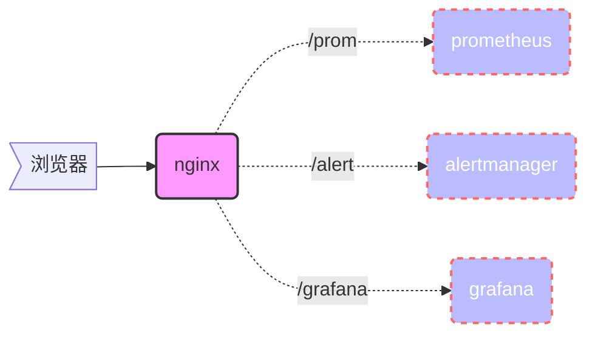

### **location**

{}

所属模块：`ngx_http_core_module`

位置：`server、location`

语法：`location [=|~|~*|^~|@] /uri/ { ... }`

{}


| 匹配动作 | 解释                  | 优先级 |
| -------- | --------------------- | ------ |
| =        | 精确匹配             | 1      |
| ^~       | 匹配以xx开头,忽略正则          | 2      |
| /html/   | 匹配目录              | 3      |
| ~        | 匹配正则 区分大小写   | 4      |
| ~*       | 匹配正则 不区分大小写 | 4      |
| /        | 默认规则              | 5      |
| @        | 内部的重定向          |        |


```nginx
location ~ .*\.(js|jpg|jpeg|JPEG|css|BMP|gif|GIF)$ {
	access_log off;
	expires 3650d;
}

location ~ ^/images/.*\.(php|php5)$ {
	deny all;
}

location ~ ^/static..*\.(php|php5)$ {
	deny all;
}

location ~* ^/data/(attachment|avatar)/.*\.(php|php5)$ {
	deny all;
}

location ~ (roboots.txt) {
		log_not_found off;
		expires 7d;
		break;
}
```


```nginx
server {
  location / {
    set $memcached_key $uri;
    memcached_pass     name:11211;
    default_type       text/html;
    error_page         404 @fallback;
  }
 
  location @fallback {
    proxy_pass http://backend;
  }
}
```


*在location 最经常使用的参数为proxy_pass，接下来参照下图解释proxy_pass中路径拼接规则*
{}
`location /foo { proxy_pass http://host/bar; }`
如果 location 后面没有 /，Nginx 会把请求的 URI 不变地拼接到 proxy_pass 后的地址。


`location /foo/ { proxy_pass http://host/bar/; }`
如果 location 后面有 /，Nginx 会把匹配到的前缀 /foo/ 去掉，然后把剩下的 URI 拼接到 proxy_pass 后的地址

{}

**示例：**





  {}

{}
访问 /prom/graph 时，Nginx 会把 /prom/graph 直接拼接到 http://192.168.0.161:9090/prom 后面，变成http://192.168.0.161:9090/prom/graph
{}

 ```nginx
         location /prom {
            proxy_pass http://192.168.0.161:9090/prom;
            proxy_set_header Host $host;
            proxy_set_header X-Real-IP $remote_addr;
            proxy_set_header X-Forwarded-For $proxy_add_x_forwarded_for;
        }
 ```


{}

访问 /prom/graph 时，Nginx 会把 /prom/graph 直接拼接到 http://192.168.0.161:9090/prom/ 后面，变成http://192.168.0.161:9090/prom//graph
{}

```nginx
        location /prom {
            proxy_pass http://192.168.0.161:9090/prom/;
            proxy_set_header Host $host;
            proxy_set_header X-Real-IP $remote_addr;
            proxy_set_header X-Forwarded-For $proxy_add_x_forwarded_for;
        }
```

  {}
  {}
{}
访问 /prom/graph 时，Nginx 会把 /prom/ 去掉，剩下 graph，拼接到 http://192.168.0.161:9090/prom/ 后面，变成http://192.168.0.161:9090/prom/graph
{}

```nginx
         location /prom/ {
            proxy_pass http://192.168.0.161:9090/prom/;
            proxy_set_header Host $host;
            proxy_set_header X-Real-IP $remote_addr;
            proxy_set_header X-Forwarded-For $proxy_add_x_forwarded_for;
        }
```

{}
访问 /prom/graph 时，Nginx 会把 /prom/ 去掉，剩下 graph，拼接到 http://192.168.0.161:9090/prom 后面，变成http://192.168.0.161:9090/promgraph
{}

```nginx
         location /prom/ {
            proxy_pass http://192.168.0.161:9090/prom;
            proxy_set_header Host $host;
            proxy_set_header X-Real-IP $remote_addr;
            proxy_set_header X-Forwarded-For $proxy_add_x_forwarded_for;
        }
```
  {}
  {}
默认情况下，nginx会将请求转发到后端的服务器上，而不会将请求的路径进行修改。如果需要将请求的路径进行修改，可以使用  `proxy_redirect` 指令。

 ```nginx
        location = /abc {
            return 301 /abc/;
        }

        location /abc/ {
            proxy_pass http://192.168.0.161:9090/prom/;
            proxy_set_header Host $host;
            proxy_set_header X-Real-IP $remote_addr;
            proxy_set_header X-Forwarded-For $proxy_add_x_forwarded_for;
            proxy_redirect /prom/ /abc/;
        }
 ```
  {}



### **rewrite**
rewrite <https://www.cnblogs.com/likwo/p/6513117.html>

Nginx 的 `rewrite` 指令的主要作用是通过**重写请求 URI**，从而满足安全、兼容、优化或特定业务逻辑需求

{}

所属模块：`ngx_http_core_module`

位置：`server、location`

基本语法：

```nginx
关键字       正则表达式        代替的内容           重写类型
rewrite     <regex>        <replacement>        <flag>

# <regex>: 可以是字符串或者正则来表示想要匹配的目标URL   
# <replacement>: 将正则匹配的内容替换成replacement
# <flag>: 重写类型：
    # last: 本条规则匹配完成后，继续向下匹配新的location URI规则；相当于Apache里(L)标记，表示完成rewrite，浏览器地址栏URL地址不变；一般写在server和if中;
    # break: 本条规则匹配完成后，终止匹配，不再匹配后面的规则，浏览器地址栏URL地址不变；一般使用在location中；
    # redirect: 返回302临时重定向，浏览器地址会显示跳转后的URL地址；
    # permanent: 返回301永久重定向，浏览器地址栏会显示跳转后的URL地址；
```


{}


```nginx
  # 访问 /last.html 的时候，页面内容重写到 /index.html 中，并继续后面的匹配，浏览器地址栏URL地址不变
  rewrite /last.html /index.html last;    

  # 访问 /break.html 的时候，页面内容重写到 /index.html 中，并停止后续的匹配，浏览器地址栏URL地址不变；    
  rewrite /break.html /index.html break;  

  # 访问 /redirect.html 的时候，页面直接302定向到 /index.html中，浏览器地址URL跳为index.html     
  rewrite /redirect.html /index.html redirect;

  # 访问 /permanent.html 的时候，页面直接301定向到 /index.html中，浏览器地址URL跳为index.html   
  rewrite /permanent.html /index.html permanent;     

  # 把 /html/*.html => /post/*.html ，301定向  
  rewrite ^/html/(.+?).html$ /post/$1.html permanent;  

  # 把 /search/key =>/search.html?keyword=key   
  rewrite ^/search\/([^\/]+?)(\/|$) /search.html?keyword=$1 permanent;  

  # 把当前域名的请求，跳转到新域名上，域名变化但路径不变    
  rewrite ^/(.*) http://www.jd.com/$1 permanent;
```


```nginx
# 隐藏真实目录
server {     
  root /var/www/html;     # 用 /html_test 来掩饰 html   
  location / {        
      rewrite /html_test /html break;  # 使用break拿一旦匹配成功则忽略后续location      
  }
   
 location /html {      
 return 403;         # 访问真实地址直接报没权限 
  }       
}

```

```nginx
# 对/images/bla_500x400.jpg文件请求，重写到/resizer/bla.jpg?width=500&height=400地址，并会继续尝试匹配location。  
rewrite ^/images/(.*)_(\d+)x(\d+)\.(png|jpg|gif)$ /resizer/$1.$4?width=$2&height=$3? last;
```

```nginx
20.防盗链
location ~* \.(jpg|gif|png|swf|flv|wmv|asf|mp3|mmf|zip|rar)${
vaild_referers none blocked *.etiantian.org etiantian.org;
if ($incalid_referer) {
	rewirte ^/http://www.etiantian.org/img/nolink.jpg;
	}
}

21.伪静态（discuz）
rewrite ^([^\.]*)/topic-(.+)\.html$ $1/portal.php?mod=topic&topic=$2 last;
rewrite ^([^\.]*)/article-([0-9]+)-([0-9]+)\.html$ $1/portal.php?mod=view&aid=$2&page=$3 last;
rewrite ^([^\.]*)/forum-(\w+)-([0-9]+)\.html$ $1/forum.php?mod=forumdisplay&fid=$2&page=$3 last;
rewrite ^([^\.]*)/thread-([0-9]+)-([0-9]+)-([0-9]+)\.html$ $1/forum.php?mod=viewthread&tid=$2&extra=page%3D$4&page=$3 last;
rewrite ^([^\.]*)/group-([0-9]+)-([0-9]+)\.html$ $1/forum.php?mod=group&fid=$2&page=$3 last;
rewrite ^([^\.]*)/space-(username|uid)-(.+)\.html$ $1/home.php?mod=space&$2=$3 last;
rewrite ^([^\.]*)/blog-([0-9]+)-([0-9]+)\.html$ $1/home.php?mod=space&uid=$2&do=blog&id=$3 last;
rewrite ^([^\.]*)/(fid|tid)-([0-9]+)\.html$ $1/index.php?action=$2&value=$3 last;
rewrite ^([^\.]*)/([a-z]+[a-z0-9_]*)-([a-z0-9_\-]+)\.html$ $1/plugin.php?id=$2:$3 last;
if (!-e $request_filename) {
	return 404;
}
```


```nginx
rewrite ^/images/(.*\.jpg)$  /images2/$1 break;
rewrite ^/abc/.*$ /$1/abc/ last

location / {
    rewrite ^/images/(.*\.jpg)$  /images2/$1 break;
    rewrite ^/abc/.*$ /$1/abc/ last
}

location /images/ {
    rewrite ^/images/(.*\.jpg)$  /images2/$1 break;
}

location /abc/ {
    rewrite ^/abc/(.*)$ /$1/abc/ last;
}

location / {
  rewrite ^/images/.*\.jpg$ /images/b.jpg break;
}

http://172.16.100.1/images/b.jpg

rewrite "^/test/(.*\.jpg)$" "/test/repire.jpg" break;

rewrite "


一、设置一个简单的URL重写：
比如，某网站原有的论坛访问路径为/forum/，但后来根据要求需要更改为/bbs，于是，就可以通过下面的方法实现：

rewrite ^/forum/?$ /bbs/ permanent;

http://172.16.100.1/forum/


1、if指令：
语法: if (condition) { ... }
应用环境: server, location

条件:

1、变量名; false values are: empty string ("", or any string starting with "0";)
2、对于变量进行的比较表达式，可使用=或!=进行测试;
3、正则表达式的模式匹配:
~  区分大小的模式匹配
~* 不区分字母大小写的模式匹配
!~ 和 !~* 分别对上面的两种测试取反
4、测试文件是否存在-f或!-f
5、测试目录是否存在-d或!-d
6、测试目录、文件或链接文件的存在性-e或!-e
7、检查一个文件的执行权限-x或!-x

在正则表达式中，可以使用圆括号标记匹配到的字符串，并可以分别使用$1,$2,...,$9进行引用；

例如：
判断用户的浏览器类型：
if ($http_user_agent ~* MSIE) {
  rewrite  ^(.*)$  /msie/$1  break;
}


if ($http_user_agent ~* opera) {
  rewrite  ^(.*)$  /opera/$1  break;
}

如果用户请求的页面不存在，实现自定义跳转：

if (!-f $request_filename) {
      rewrite ^(/.*)$ /rewrite.html permanent;
}


实现域名跳转
server
{
    listen 80;
    server_name jump.magedu.com;
    index index.html index.php;
    root /www/htdocs;
    rewrite ^/ http://www.magedu.com/;
}

实现域名镜像
server
{
listen 80;
server_name mirror.magedu.com;
index index.html index.php;
root /www/htdocs;
rewrite ^/(.*)$ http://www.magedu.com/$1 last;
}

简单的防盗链配置：
location ~* \.(gif|jpg|png|swf|flv)$ {
  valid_referers none blocked www.magedu.com;
  if ($invalid_referer) {
    rewrite ^/ http://www.magedu.com/403.html;
    # return 404
  }
}
第一行：gif|jpg|png|swf|flv
表示对gif、jpg、png、swf、flv后缀的文件实行防盗链
第二行：www.magedu.com
表示对www.magedu.com这个来路进行判断if{}里面内容的意思是，如果来路不是指定来路就跳转到错误页面，当然直接返回404也是可以的。

if (!-e $request_filename) {
      rewrite ^/user/([0-9]+)/?$ /view.php?go=user_$1 last;
      rewrite ^/component/id/([0-9]+)/?$ /page.php?pageid=$1 last;
      rewrite ^/component/([^/]+)/?$ /page.php?pagealias=$1 last;
      rewrite ^/category\_([0-9]+)\.htm$ http://$host/category/$1/ permanent;
      rewrite ^/showday\_([0-9]+)\_([0-9]+)\_([0-9]+)\.htm$ http://$host/date/$1/$2/$3/ permanent;
      showday_1_2_3.htm $host/date/1/2/3/
}


server {
  listen 80 default;
  server_name *.mysite.com;
  rewrite ^ http://mysite.com$request_uri permanent;
}
```


### if

{}
if判断自定义和内置全局环境变量

位置: 全局 `location` 指令下

语法: `if (表达式) { };`
{}

> 例如访问： `http://localhost:81/download/stat.php?id=1585378&web_id=1585378 `       
> root：/var/www/html     


| 变量                 | 解释                                                         |      示例                                        |
| -------------------- | ------------------------------------------------------------ | -------------------------------------------- |
| `$args`              | 这个变量等于请求行中的参数，同$query_string                  |                                              |
| `$content_length`    | 请求头中的Content-length字段                                 |                                              |
| `$content_type`      | 请求头中的Content-Type字段                                   |                                              |
| `$document_root`     | 当前请求在root指令中指定的值                                 | /var/www/html                                |
| `$host`              | 请求主机头字段，否则为服务器名称                             | localhost                                    |
| `$http_user_agent`   | 客户端agent信息                                              |                                              |
| `$http_cookie`       | 客户端cookie信息                                             |                                              |
| `$limit_rate`        | 这个变量可以限制连接速率                                     |                                              |
| `$request_method`    | 客户端请求的动作，通常为GET或POST                            |                                              |
| `$request_body_file` |                                                              |                                              |
| `$request_filename`  | 当前请求的文件路径，由root或alias指令与URI请求生成           | /var/www/html/download/stat.php              |
| `$request_uri`       | 包含请求参数的原始URI，不包含主机名，如：”/foo/bar.php?arg=baz” | /download/stat.php?id=1585378&web_id=1585378 |
| `$query_string`      |                                                              |                                              |
| `$remote_addr`       | 客户端的IP地址                                               |                                              |
| `$remote_port`       | 客户端的端口                                                 |                                              |
| `$remote_user`       | 已经经过Auth Basic Module验证的用户名                        |                                              |
| `$scheme`            | HTTP方法（如http，https）                                    |                                              |
| `$server_protocol`   | 请求使用的协议，通常是HTTP/1.0或HTTP/1.1                     |                                              |
| `$server_addr`       | 服务器地址，在完成一次系统调用后可以确定这个值               |                                              |
| `$server_name`       | 服务器名称                                                   |                                              |
| `$server_port`       | 请求到达服务器的端口号                                       | 81                                           |
| `$uri`               | 不带请求参数的当前URI，$uri不包含主机名，如”/foo/bar.html    |                                              |
| `$document_uri`      | 与$uri相同                                                   | /download/stat.php                           |


条件表达式

```nginx
正则表达式匹配：
    ~：与指定正则表达式模式匹配时返回“真”，判断匹配与否时区分字符大小写；
    ~*：与指定正则表达式模式匹配时返回“真”，判断匹配与否时不区分字符大小写；
    !~：与指定正则表达式模式不匹配时返回“真”，判断匹配与否时区分字符大小写；
    !~*：与指定正则表达式模式不匹配时返回“真”，判断匹配与否时不区分字符大小写；

文件及目录匹配判断：
    -f, !-f：判断指定的路径是否为存在且为文件；
    -d, !-d：判断指定的路径是否为存在且为目录；
    -e, !-e：判断指定的路径是否存在，文件或目录均可；
    -x, !-x：判断指定路径的文件是否存在且可执行；
```


```nginx
# 如果文件不存在则返回400  
if (!-f $request_filename) {     
    return 400;    
}
# 如果host是www.360buy.com，则301到www.jd.com中
if ( $host != "www.jd.com" ){
 rewrite ^/(.*)$ https://www.jd.com/$1 permanent;
}
# 如果请求类型是POST则返回405，return不能返回301,302
if ($request_method = POST) { 
    return 405; 
}
# 如果参数中有 a=1 则301到指定域名
if ($args ~ a=1) {     
    rewrite ^ http://example.com/ permanent;   
}   
# 文件名及参数重写
 location = /index.html {       
 set $name test;    # 修改默认值为         
 if($args ~* name=(\w+?)(&|$)) {      
     set $name $1;     # 如果参数中有 name=xx 则使用该值 
 }
 #permanent 301重定向     
 rewrite ^ /$name.html permanent;      
} 
 # 禁止指定IP访问
location / {
        if ($remote_addr = 192.168.1.253) {
                return 403;
    }       
}

# 如果请求的文件不存在，则反向代理到localhost 。这里的break也是停止继续rewrite 
if (!-f $request_filename){        
    break;      
    proxy_pass http://127.0.0.1;     
}

location / {
    if ($http_user_agent ~* "andriod")
        {
        proxy_pass http://lb1;
    }

    if ($http_user_agent ~* "iphome")
        {
        proxy_pass http://lb2;
    }

   if ($http_user_agent ~* "qihoobot|Baiduspider|Googlebot|Googlebot-Mobile|Googlebot-Image|Mediapartners-Google|Adsbot-Google|Feedfetcher-Google|Yahoo! Slurp|Yahoo! Slurp China|YoudaoBot|Sosospider|Sogou spider|Sogou web spider|MSNBot|ia_archiver|Tomato Bot") 
   { 
    return 403; 
   } 
}
```


```nginx
在location中使用if语句可以实现条件判断，其通常有一个return语句，且一般与有着last或break标记的rewrite规则一同使用。但其也可以按需要使用在多种场景下，需要注意的是，不当的使用可能会导致不可预料的后果。

location / {
    if ($request_method == “PUT”) {
        proxy_pass http://upload.magedu.com:8080;
    } 

    if ($request_uri ~ "\.(jpg|gif|jpeg|png)$") {
        proxy_pass http://imageservers;
        break;
    }
}
```


```nginx
agent 参数    根基客户端设备不同选择主机
_______________________________________________________
upstream LB1 {
    server 10.0.0.2:81 weight=10;
    server 10.0.0.3:82 weight=6 down;
    server 10.0.0.1:83 weight=5 backup max_fails=2 fail_timeout=20s;
    ip_hash;
upstream LB2 {
    server 10.0.0.2:84 weight=10;
    server 10.0.0.3:85 weight=6 down;
    server 10.0.0.1:86 weight=5 backup max_fails=2 fail_timeout=20s;
    ip_hash;
}
server {
    listen 80;
    server_name blog.etiantian.org;
    location / {
            if ($http_user_agent ~* "andriod")
                {
                proxy_pass http://lb1;
            }
            if ($http_user_agent ~* "iphone")
                {
                proxy_pass http://lb2;
            }
            proxy_pass http://lb1;
            proxy_set_header  X-Real-IP $remote_addr; 后端服务器接收到真实的客户IP
            proxy_set_header  X-Forwarded-For $remote_addr; 后端服务器接收到真实的客户IP
            proxy_set_header  Host $host;   按照负载均衡的server_name 名称查找后端的基于域名的虚拟主机
        }
    }
```

